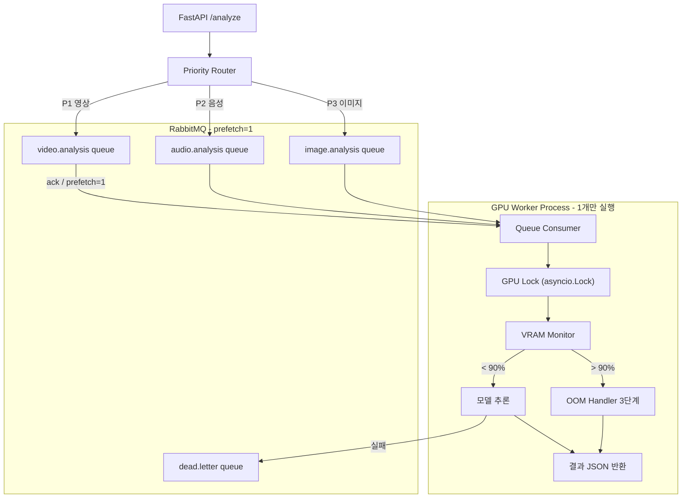
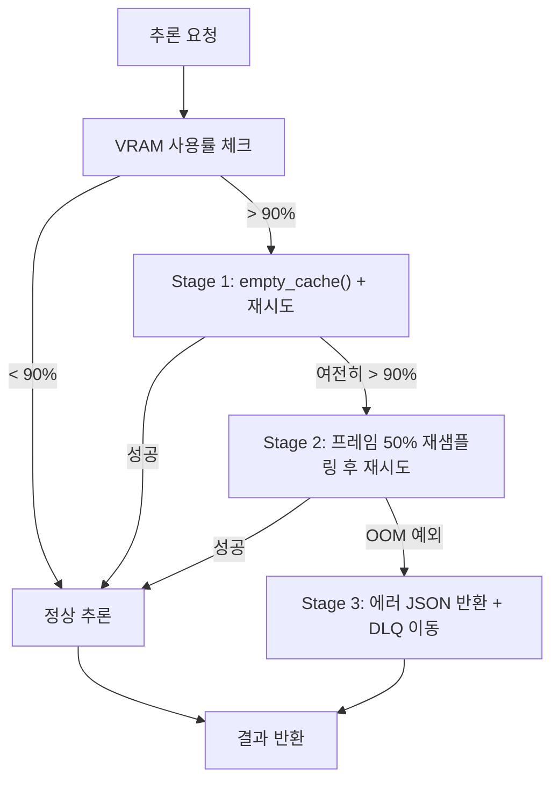

# GPU 멀티모달 AI 스케줄링 아키텍처

## 전체 흐름



## 디렉토리 구조

```
gpu_worker/
├── main.py               # RabbitMQ consumer 진입점
├── config.py             # VRAM 임계치, queue 이름 상수
├── gpu_manager.py        # VRAM 모니터링 + 글로벌 Lock
├── oom_handler.py        # 3단계 OOM 대응 로직
├── scheduler.py          # 모델 lazy-load + 우선순위 라우팅
└── models/
    ├── video_model.py    # Xception 래퍼
    ├── audio_model.py    # AASIST / RawNet2 래퍼
    └── image_model.py    # ELA / PRNU 래퍼
```

## 핵심 설계 결정

### 1. 순차 처리 vs 동시 처리 비교

| 항목 | 동시 처리 | 순차 처리 (채택) |
|------|-----------|-----------------|
| VRAM 안전성 | OOM 위험 | 1개 작업만 GPU 점유 |
| 처리량 | 높음 (이론) | 낮음 (실질적으로 GPU 병목) |
| 장애 격리 | 한 모델 OOM → 전체 다운 | 개별 작업 실패가 격리됨 |
| 구현 복잡도 | 높음 (CUDA 메모리 공유 관리) | 낮음 |

→ RTX 5080은 실제로 GPU가 병목이므로 동시 처리의 이점이 없음. 순차 처리 채택.

### 2. RabbitMQ 큐 설계 원칙

- `basic_qos(prefetch_count=1)` 필수: 워커가 1개 메시지만 수신
- 3개 큐 분리: `video.analysis` / `audio.analysis` / `image.analysis`
- Dead Letter Queue: 3회 재시도 후 `dead.letter` 큐로 이동
- 메시지 만료(TTL): 영상 30분, 음성 10분, 이미지 5분

### 3. 모델 로딩 전략 (Lazy Load)

모든 모델을 시작 시 적재하면 ~6GB 기본 점유. 대신 요청 시 로드하고 `torch.cuda.empty_cache()` 후 다음 모델 적재.

```python
# gpu_manager.py 핵심 로직 스케치
import torch
import asyncio

GPU_THRESHOLD = 0.90  # 90%
_gpu_lock = asyncio.Lock()

def get_vram_usage() -> float:
    allocated = torch.cuda.memory_allocated()
    total = torch.cuda.get_device_properties(0).total_memory
    return allocated / total

async def acquire_gpu(task_fn, *args):
    async with _gpu_lock:           # 동시 실행 방지
        if get_vram_usage() > GPU_THRESHOLD:
            torch.cuda.empty_cache()  # Stage 1
        return await task_fn(*args)
```

### 4. 3단계 OOM 방어 시나리오



**Stage 1** - `torch.cuda.empty_cache()` 호출 후 즉시 재시도

**Stage 2** - 비디오: `cv2`로 keyframe을 `original_fps // 2`로 재샘플링. 오디오: 16kHz → 8kHz 다운샘플링

**Stage 3** - 시스템 다운 없이 아래 형식으로 반환:
```json
{
  "status": "error",
  "code": "OOM_UNRECOVERABLE",
  "message": "VRAM 임계치 초과로 처리 불가",
  "retry_hint": "파일 크기를 줄이거나 나중에 재시도하세요"
}
```

### 5. 대용량 파일 기준 정의

| 미디어 타입 | 일반 처리 | 대용량 기준 | 조치 |
|-------------|-----------|-------------|------|
| 영상 | ≤ 100MB / ≤ 5분 | > 100MB 또는 > 5분 | Stage 2 프레임 드롭 적용 |
| 음성 | ≤ 50MB / ≤ 10분 | > 50MB 또는 > 10분 | 다운샘플링 적용 |
| 이미지 | ≤ 20MB | > 20MB | 리사이즈 후 처리 |

## 구현 순서

1. `config.py` - 상수, VRAM 임계치, 큐 이름
2. `gpu_manager.py` - VRAM 모니터 + asyncio Lock
3. `oom_handler.py` - 3단계 대응 로직
4. `models/` - 각 모델 lazy-load 래퍼
5. `scheduler.py` - 우선순위 라우팅 + 모델 호출
6. `main.py` - RabbitMQ consumer + prefetch=1 설정