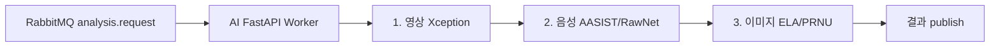
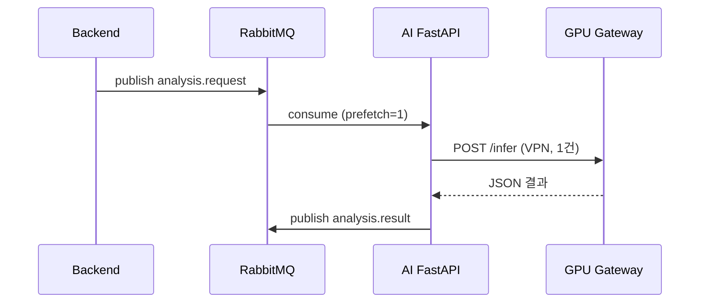

# ForenShield AI — GPU 자원 활용 가이드

> **문서 시리즈:** [README](./README.md) · **다음:** [7. AI 배포](./7.ai-deploy.md)  
> **대상:** On-Prem RTX 5080 GPU Gateway + EKS AI FastAPI Pod  
> **하드웨어:** NVIDIA RTX 5080 (VRAM 16GB), Ubuntu Server 24.04 LTS

제한된 **단일 GPU** 환경에서 영상·음성·이미지 멀티모달 AI 추론이 상호 간섭·OOM 없이 안정적으로 동작하도록 **자원 할당 전략**, **우선순위**, **큐 처리**, **대용량 파일 기준**, **VRAM 초과 대응**을 정리한 문서입니다.

---

## 목차

1. [작업 목적](#1-작업-목적)
2. [Jira 작업 항목 매핑](#2-jira-작업-항목-매핑)
3. [UDPB-205 — GPU 사용 모델 목록](#3-udpb-205--gpu-사용-모델-목록)
4. [UDPB-206 — 분석 우선순위](#4-udpb-206--분석-우선순위)
5. [UDPB-209 — 동시 vs 순차 처리](#5-udpb-209--동시-vs-순차-처리)
6. [UDPB-210 — RabbitMQ 큐 처리](#6-udpb-210--rabbitmq-큐-처리)
7. [UDPB-212 — 대용량 파일 처리 기준](#7-udpb-212--대용량-파일-처리-기준)
8. [UDPB-213 — GPU 메모리 초과 대응](#8-udpb-213--gpu-메모리-초과-대응)
9. [Phase 1 — GPU 서버 원격 통제 테스트](#9-phase-1--gpu-서버-원격-통제-테스트)
10. [사용 스택 · 완료 기준](#10-사용-스택--완료-기준)

---

## 1. 작업 목적

| 항목 | 내용 |
|------|------|
| **배경** | EKS AI FastAPI Pod에는 GPU가 없고, 실제 추론은 VPN 경유 **On-Prem RTX 5080** 한 대에서 수행 |
| **문제** | 여러 모델·요청이 동시에 GPU를 점유하면 VRAM 부족 → 프로세스 전체 다운(OOM) |
| **목표** | 자원 할당·우선순위 정의, RabbitMQ 기반 순차 처리 채택, 대용량 미디어 병목 예방, VRAM 초과 시 방어 로직 확정 |

---

## 2. Jira 작업 항목 매핑

| Jira ID | 제목 | 본 문서 섹션 | 상태 |
|---------|------|-------------|------|
| **UDPB-205** | GPU 사용 모델 목록 정리 | [§3](#3-udpb-205--gpu-사용-모델-목록) | 문서화 |
| **UDPB-206** | 영상·음성·이미지 분석 우선순위 정의 | [§4](#4-udpb-206--분석-우선순위) | 문서화 |
| **UDPB-209** | 동시 처리와 순차 처리 방식 비교 | [§5](#5-udpb-209--동시-vs-순차-처리) | 문서화 |
| **UDPB-210** | RabbitMQ 기반 큐 처리 필요성 정리 | [§6](#6-udpb-210--rabbitmq-큐-처리) | 문서화 |
| **UDPB-212** | 대용량 파일 처리 기준 정리 | [§7](#7-udpb-212--대용량-파일-처리-기준) | 문서화 |
| **UDPB-213** | GPU 메모리 초과 시 대응 방식 작성 | [§8](#8-udpb-213--gpu-메모리-초과-대응) | 문서화 |

---

## 3. UDPB-205 — GPU 사용 모델 목록

On-Prem GPU Gateway에서 로드·추론하는 모델 목록과 **예상 VRAM 점유**입니다.  
수치는 RTX 5080(16GB), 배치 1·FP32 기준 **초기 추정치**이며, 실측 후 `nvidia-smi` 로그로 보정합니다.

| 모달리티 | 모델 / 툴킷 | 역할 | 예상 VRAM | 비고 |
|----------|-------------|------|-----------|------|
| **영상** | Xception (코어) | 딥페이크·조작 영상 탐지 | **6 ~ 10 GB** | 프레임 수·해상도에 민감, 최대 소비 모델 |
| **음성** | AASIST | 스푸핑·합성 음성 탐지 | **2 ~ 4 GB** | 스펙트로그램 길이에 비례 |
| **음성** | RawNet | 음성 위조 탐지 (보조) | **2 ~ 3 GB** | AASIST와 동시 로드 비권장 |
| **이미지** | ELA / PRNU 툴킷 | 이미지 조작·카메라 지문 분석 | **0.5 ~ 2 GB** | CPU/GPU 하이브리드, 상대 경량 |

### 3.1 VRAM 예산 (단일 작업 기준)

```
RTX 5080 총 VRAM:     16 GB
OS / CUDA 예약:       ~1 GB
안전 마진 (10%):      ~1.5 GB
─────────────────────────────
단일 추론 가용:       ~13.5 GB  → 1 작업 1 모델 원칙
```

### 3.2 모델 로드 정책

- GPU Gateway 기동 시: **자주 쓰는 1개 모델만** 상주 로드 (기본: 영상 Xception 또는 요청 빈도 최다 모델).
- 모달리티 전환 시: 이전 모델 `unload` → `torch.cuda.empty_cache()` → 신규 모델 로드.
- S3 모델 경로: `s3://forenshield-models/{version}/` ([7. AI 배포](./7.ai-deploy.md) 참고).

---

## 4. UDPB-206 — 분석 우선순위

단일 GPU에서 **동시에 여러 모달리티를 돌리지 않고**, 큐에서 꺼낸 작업을 아래 우선순위로 스케줄링합니다.

| 순위 | 모달리티 | 모델 | 스케줄링 규칙 |
|------|----------|------|---------------|
| **1** | 영상 | Xception | VRAM·처리 시간이 가장 큼. **전용 슬롯** 할당. 프레임 샘플링으로 입력 크기 상한 적용 |
| **2** | 음성 | AASIST / RawNet | 영상 작업 완료 후, 또는 큐에 영상 대기 없을 때 처리 |
| **3** | 이미지 | ELA / PRNU | 상대 경량 → **백그라운드·저우선** 큐 또는 영상·음성 유휴 시 처리 |

### 4.1 스케줄링 규칙 (요약)

1. 큐 FIFO 기본, **동일 우선순위 내** 선입선출.
2. 영상 작업이 `processing` 상태이면 음성·이미지는 **대기**(순차 처리).
3. 긴급·법정 기한 케이스는 Backend 메시지 `priority: high` 필드로 영상 큐 앞 삽입 (선택 구현).
4. 한 건의 분석 요청에 복수 모달리티가 포함되면: **영상 → 음성 → 이미지** 순으로 **직렬** 실행 (병렬 금지).



---

## 5. UDPB-209 — 동시 vs 순차 처리

### 5.1 방식 비교

| 구분 | 동시 처리 (Parallel) | 순차 처리 (Sequential) — **채택** |
|------|----------------------|-----------------------------------|
| **구조** | 요청마다 GPU 스레드/프로세스 동시 추론 | RabbitMQ Worker가 **1회 1작업** consume 후 GPU 호출 |
| **VRAM** | 모델 N개 × 배치 → 16GB 초과 위험 높음 | 단일 모델·단일 배치 → 예측 가능 |
| **지연** | 짧은 작업도 긴 영상에 밀림 (자원 경합) | 큐 대기 증가 가능, **OOM·다운 없음** |
| **복구** | OOM 시 프로세스 전체 재시작 | 작업 단위 실패·재시도 가능 |
| **적합** | GPU 다수·VRAM 여유 클러스터 | **단일 RTX 5080** (본 프로젝트) |

### 5.2 채택 결론

> **ForenShield AI는 순차 처리(Sequential)를 기본**으로 한다.  
> AI FastAPI Pod는 RabbitMQ에서 메시지를 **하나씩** 가져와 GPU Gateway `POST /infer`를 **직렬** 호출한다.

EKS Pod replica를 2 이상으로 늘리더라도, **GPU Gateway 측에서는 동시 infer 요청을 1개로 제한**(세마포어·뮤텍스 또는 단일 워커 큐)해야 한다.

---

## 6. UDPB-210 — RabbitMQ 큐 처리

### 6.1 도입 필요성

| 이유 | 설명 |
|------|------|
| **비동기 분리** | Backend(Spring)는 분석 요청을 즉시 202 Accepted 후 큐에 적재 — HTTP 타임아웃 방지 |
| **백프레셔** | GPU 처리 속도 < 업로드 속도일 때 RabbitMQ가 버퍼 역할 |
| **재시도** | GPU 일시 장애 시 NACK·DLQ로 재처리 가능 |
| **순차 보장** | `prefetch_count=1` 로 Worker당 동시 처리 1건 제한 |

### 6.2 메시지 흐름



### 6.3 Consume 권장 설정

| 항목 | 권장값 | 비고 |
|------|--------|------|
| Exchange | `analysis` (topic 또는 direct) | Backend·AI 팀 합의 |
| Queue | `analysis.request` | durable |
| `prefetch_count` | **1** | 순차 처리 핵심 |
| ACK | 처리 성공 후 `basic_ack` | 실패 시 `nack` + requeue 제한 |
| 타임아웃 | GPU infer 30분+ (대용량 영상) | 메시지 TTL·consumer timeout 조정 |

상세 배포: [7. AI 배포](./7.ai-deploy.md), [6. Backend](./6.backend-deploy.md)

---

## 7. UDPB-212 — 대용량 파일 처리 기준

S3 `forenshield-evidence`에 적재되는 증거 파일에 대한 **처리 등급**입니다.  
초과 시 전처리·샘플링·거부 정책을 적용합니다.

### 7.1 모달리티별 기준

| 모달리티 | 일반 | 주의 (전처리 강화) | 대용량 (큐 지연·VRAM 위험) | 초과 시 정책 |
|----------|------|-------------------|---------------------------|-------------|
| **영상** | ≤ 500 MB, ≤ 10분, 1080p 이하 | 500 MB ~ 2 GB, 10~30분 | **> 2 GB** 또는 **> 30분** 또는 **4K** | 프레임 50% 드롭 후에도 초과 시 `413` + JSON 에러 |
| **음성** | ≤ 50 MB, ≤ 15분 | 50 ~ 200 MB | **> 200 MB** 또는 **> 60분** | 청크 분할 추론 또는 거부 |
| **이미지** | ≤ 20 MB | 20 ~ 100 MB | **> 100 MB** (TIFF·RAW 등) | 리사이즈 후 추론 또는 CPU-only 경로 |

### 7.2 영상 전처리 (VRAM·시간 절감)

- 기본: **1 fps** 또는 **최대 300 프레임** 중 작은 값으로 샘플링.
- 주의 등급: 최대 **150 프레임**.
- 대용량: 최대 **75 프레임** + 해상도 720p 다운스케일.

### 7.3 다운로드·네트워크

- GPU → S3 다운로드는 VPN·대역폭 병목 가능 (인프라 비용 산정 문서 참고).
- AI FastAPI는 **파일 크기 메타**를 메시지에 포함해 GPU Gateway가 사전 판단하도록 권장.

---

## 8. UDPB-213 — GPU 메모리 초과 대응

VRAM 사용률 **90%** 이상 또는 CUDA OOM 예외 발생 시 **3단계** 대응합니다.  
시스템 전체 다운을 막고, 호출자에게 구조화된 JSON 오류를 반환합니다.

### 8.1 모니터링

```bash
# GPU 서버에서 주기 확인
nvidia-smi --query-gpu=memory.used,memory.total,utilization.gpu --format=csv
```

| 임계치 | 동작 |
|--------|------|
| VRAM **< 80%** | 정상 추론 |
| VRAM **80 ~ 90%** | 경고 로그, 신규 infer 대기(큐 홀드) |
| VRAM **≥ 90%** 또는 OOM | [8.2 단계별 대응](#82-단계별-대응) |

### 8.2 단계별 대응

| 단계 | 조건 | 조치 | API 응답 |
|------|------|------|----------|
| **1** | 80~90% 또는 1회 OOM 직전 | `torch.cuda.empty_cache()`, 불필요 텐서 해제, 동일 요청 **1회 재시도** | 성공 시 200 |
| **2** | 90% 초과 또는 1회 OOM 후 | Keyframe **재샘플링(프레임 50% 감소)**, 해상도 다운스케일 | 성공 시 200 + `degraded: true` |
| **3** | 2단계 후에도 OOM | 추론 중단, 작업 실패 기록 | `503` 또는 `422` + `{"error":"GPU_OOM","message":"..."}` |

### 8.3 구현 스니펫 (참고)

```python
import torch

def release_gpu_cache():
    if torch.cuda.is_available():
        torch.cuda.empty_cache()
        torch.cuda.synchronize()
```

- 단계 2: 전처리 파이프라인에서 `max_frames //= 2` 적용.
- 단계 3: RabbitMQ 메시지 **nack without requeue** → DLQ 또는 Backend에 실패 상태 전달.

### 8.4 운영 체크리스트 (OOM 발생 시)

- [ ] `nvidia-smi`로 VRAM·프로세스 PID 확인
- [ ] 동시 infer 요청이 2건 이상인지 확인 (있으면 Worker 설정 수정)
- [ ] 해당 증거 파일 크기·길이가 [§7](#7-udpb-212--대용량-파일-처리-기준) 초과인지 확인
- [ ] GPU Gateway 재시작 전 큐 `prefetch=1` 유지

---

## 9. Phase 1 — GPU 서버 원격 통제 테스트

AWS EKS·VPN 구축 **전에** On-Prem GPU 서버가 원격에서 호출 가능한지 검증합니다.  
([README Phase 1](./README.md)과 동일 목표)

### Step 1 — Ubuntu 설치 및 네트워크

**OS 예시:** Ubuntu Server 24.04 LTS

설치 후 IP 확인:

```bash
ip addr
# 예: 192.168.0.50
```

**SSH 서버 설치 (GPU 서버에서):**

```bash
sudo apt update
sudo apt install openssh-server
sudo systemctl status ssh   # active (running) 확인
```

**노트북에서 접속:**

```powershell
# Windows PowerShell
ssh ubuntu@192.168.0.50
# 또는
ssh deepfake@192.168.0.50
```

접속 성공 예: `deepfake@gpu-server:~$`

### Step 2 — GPU 인식 확인

```bash
nvidia-smi
```

GPU 이름이 보이지 않으면 → **NVIDIA 드라이버 미설치**. 인프라 테스트 전 팀/관리자에게 드라이버 설치 요청.

### Step 3 — 간단 API 띄우기 (통제 테스트)

```bash
mkdir -p ~/gpu-test && cd ~/gpu-test
python3 -m venv venv
source venv/bin/activate
pip install fastapi uvicorn
```

`main.py`:

```python
from fastapi import FastAPI

app = FastAPI()

@app.get("/health")
def health():
    return {"status": "ok", "message": "GPU server reachable"}
```

실행:

```bash
uvicorn main:app --host 0.0.0.0 --port 8080
```

**로컬 확인 (GPU 서버 안):**

```bash
curl http://127.0.0.1:8080/health
# 기대: {"status":"ok",...}
```

### Step 4 — 원격에서 API 확인

Step 3 실행 중, **내 PC**에서:

```bash
curl http://192.168.0.50:8080/health
```

Windows에 `curl`이 없으면 브라우저: `http://192.168.0.50:8080/health`

| 결과 | 의미 |
|------|------|
| JSON 동일 출력 | 원격 통제·호출 가능 |
| 타임아웃 | 방화벽 **8080** 허용 필요 |

### Step 5 — (선택) S3 연결 테스트

```bash
aws configure   # 팀 Access Key
aws s3 ls s3://forenshield-evidence/
```

처음 주차는 **Step 1~4만** 수행해도 됨.

### Step 6 — (나중) VPN + EKS 테스트

인프라팀 VPN·EKS 구축 후:

```bash
# EKS Pod 안에서
curl http://192.168.0.50:8080/health
```

**초기 주차에는 Step 6 생략.** Phase 1 완료 후 [7. AI 배포](./7.ai-deploy.md) 진행.

### Phase 1 완료 체크리스트

| # | 항목 | 기대 결과 |
|---|------|-----------|
| 1 | `nvidia-smi` | RTX 5080 정상 인식 |
| 2 | `/health` (서버 로컬) | `{"status":"ok"}` |
| 3 | `/health` (내 PC) | 동일 JSON |
| 4 | (선택) `aws s3 ls` | evidence 버킷 목록 |

---

## 10. 사용 스택 · 완료 기준

### 10.1 사용 스택

| 구분 | 기술 |
|------|------|
| 추론 | Python, PyTorch, NVIDIA CUDA Toolkit |
| API | FastAPI, Uvicorn |
| 메시지 큐 | RabbitMQ (Pika / Spring AMQP) |
| 모니터링 | `nvidia-smi`, CloudWatch (EKS 연동 후) |
| 스토리지 | S3 `forenshield-evidence`, `forenshield-models` |
| 네트워크 | Site-to-Site VPN (EKS ↔ On-Prem) |

### 10.2 완료 기준 (Jira 연계)

| # | 기준 | 관련 Jira |
|---|------|-----------|
| 1 | GPU 사용 모델 목록·VRAM 바운더리 문서화 | UDPB-205 |
| 2 | 영상·음성·이미지 우선순위·스케줄링 규칙 확정 | UDPB-206 |
| 3 | 동시 vs 순차 비교 및 **순차+RabbitMQ** 채택 근거 명시 | UDPB-209, UDPB-210 |
| 4 | 대용량 파일 등급·전처리·거부 기준 표 확정 | UDPB-212 |
| 5 | VRAM 3단계 예외 처리 시나리오 확정 | UDPB-213 |
| 6 | Phase 1 GPU 원격 통제 테스트 통과 | 운영 |

### 10.3 구현 범위 요약

- GPU 사용 모델 목록(Xception, AASIST, RawNet, ELA/PRNU) 및 모델별 VRAM 예상치
- 영상·음성·이미지 처리 우선순위 및 스케줄링 규칙
- 동시(Parallel) vs 순차(Sequential) 아키텍처 비교
- RabbitMQ 비동기 큐·`prefetch_count=1` Consume 방식
- 대용량 파일 기준 및 OOM 방지 가이드라인
- GPU VRAM 초과 시 3단계 대응 시나리오

---

*문서 버전: 2026-06-05 · Jira UDPB-205 ~ 213 반영*
