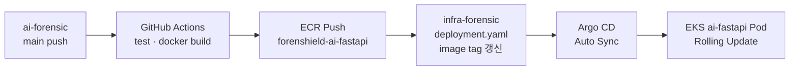

# 12. AI 배포 가이드 — GPU 공인 IP 직통 + CI/CD + Argo CD (따라하기)

> **문서 시리즈:** [9. 백엔드·프론트 연결](./9.connect-backend-frontend.md) · [7. AI 배포 (VPN 버전)](./7.ai-deploy.md) · [1. GPU 가이드](./1.gpu_use_guide.md)  
> **대상 코드:** `ai/ai-forensic` (FastAPI) · GPU 서버 (RTX 5080, Ubuntu)  
> **Infra 매니페스트:** `Infra/config/k8s/ai-fastapi/` → GitHub `infra-forensic` → Argo CD  
> **전제:** EKS · ECR · RabbitMQ · Argo CD · 백엔드/프론트 배포 완료 ([9번 문서](./9.connect-backend-frontend.md) 기준)

이 문서는 **VPN 없이** EKS AI Pod가 **GPU 서버 공인 IP**로 직접 HTTP 호출하는 방식으로 AI 파트를 배포합니다.  
코드는 GitHub Actions CI/CD로 ECR에 올리고, **infra-forensic 저장소의 K8s 매니페스트를 갱신**하면 Argo CD가 EKS에 자동 반영(GitOps)합니다.

> **7번 문서와의 차이:** [7.ai-deploy.md](./7.ai-deploy.md)는 Site-to-Site VPN + 사설 IP(`192.168.x.x`) 기준입니다.  
> 본 문서는 **공인 IP 직통** + **Argo CD GitOps** 기준입니다. VPN 구축 단계는 **건너뜁니다.**

---

## 목차

- [0. 한눈에 보는 최종 그림](#0-한눈에-보는-최종-그림)
- [1. 사전 준비 — 값 정리 & 도구 확인](#1-사전-준비--값-정리--도구-확인)
- [2. GPU 서버 — 공인 IP · 방화벽 · AI Gateway 기동](#2-gpu-서버--공인-ip--방화벽--ai-gateway-기동)
- [3. ECR 레포지토리 생성](#3-ecr-레포지토리-생성)
- [4. Infra 저장소 — K8s 매니페스트 추가](#4-infra-저장소--k8s-매니페스트-추가)
- [5. ConfigMap — GPU 공인 IP 반영](#5-configmap--gpu-공인-ip-반영)
- [6. Argo CD 연동 확인](#6-argo-cd-연동-확인)
- [7. GitHub Actions CI/CD (ai-forensic → ECR → infra-forensic)](#7-github-actions-cicd-ai-forensic--ecr--infra-forensic)
- [8. 수동 1회 배포 (CI/CD 세팅 전 테스트)](#8-수동-1회-배포-cicd-세팅-전-테스트)
- [9. 배포 검증](#9-배포-검증)
- [10. 트러블슈팅](#10-트러블슈팅)
- [11. 전체 체크리스트](#11-전체-체크리스트)

---

## 0. 한눈에 보는 최종 그림

### 0.1 트래픽 흐름 (VPN ❌ · 공인 IP ✅)

```text
사용자
  └─ https://forensheildjangdochi.com
        └─ Backend Pod (EKS)
              ├─ RabbitMQ (EKS 내부)
              │     └─ AI FastAPI Pod (EKS)  ←── CI/CD + Argo CD로 배포
              │           └─ HTTP ──→ GPU 서버 공인 IP:8000  (인터넷 직통)
              │                         └─ PyTorch 추론 (RTX 5080)
              └─ S3 evidence / models (IRSA)
```

### 0.2 GitOps 배포 흐름




### 0.3 역할 분담


| 구성요소               | 위치                   | 배포 방식                        | 비고                          |
| ------------------ | -------------------- | ---------------------------- | --------------------------- |
| **AI FastAPI Pod** | EKS `ai-fastapi-ng`  | CI/CD → ECR → Argo CD        | RabbitMQ 소비, GPU 호출 오케스트레이션 |
| **GPU Gateway**    | On-Prem GPU 서버       | systemd (수동 또는 별도 CI)        | 실제 추론. **공인 IP:8000** 노출    |
| **K8s 매니페스트**      | `infra-forensic` Git | 수동 1회 추가 후 CI가 image tag만 갱신 | Argo CD가 watch              |


---

## 1. 사전 준비 — 값 정리 & 도구 확인

### 1.1 미리 적어둘 값 (팀 공유 시트에 기록)

아래 `<...>` 는 **실제 값으로 교체**하세요. 예시는 현재 ForenShield 인프라 기준입니다.


| 변수                    | 예시 / 설명                                                   | 어디에 씀                      |
| --------------------- | --------------------------------------------------------- | -------------------------- |
| `AWS_ACCOUNT_ID`      | `877044078824`                                            | ECR URL                    |
| `AWS_REGION`          | `ap-northeast-2`                                          | ECR · EKS                  |
| `ECR_REGISTRY`        | `877044078824.dkr.ecr.ap-northeast-2.amazonaws.com`       | 이미지 Push                   |
| `EKS_CLUSTER`         | `forenshield`                                             | kubectl                    |
| `K8S_NAMESPACE`       | `forenshield`                                             | Deployment                 |
| `GPU_PUBLIC_IP`       | `<GPU서버 공인 IP>`                                           | ConfigMap `AI_GATEWAY_URL` |
| `GPU_PORT`            | `8000`                                                    | AI Gateway 포트              |
| `EKS_NAT_IP`          | `<EKS NAT Gateway 공인 IP>`                                 | GPU 방화벽 Inbound 허용         |
| `ai-forensic repo`    | `https://github.com/sk-final-deepfake/ai-forensic.git`    | CI/CD                      |
| `infra-forensic repo` | `https://github.com/sk-final-deepfake/infra-forensic.git` | Argo CD                    |


### 1.2 EKS NAT Gateway IP 확인 (방화벽 화이트리스트용)

EKS Pod가 GPU 공인 IP로 나갈 때 **NAT Gateway IP** 하나(또는 AZ별 여러 개)로 보입니다.  
GPU 방화벽은 이 IP만 `:8000` Inbound 허용하면 됩니다.

```bash
export AWS_PROFILE=forenshield   # PowerShell: $env:AWS_PROFILE="forenshield"

# VPC ID 확인
export VPC_ID=$(aws eks describe-cluster --name forenshield --region ap-northeast-2 \
  --query 'cluster.resourcesVpcConfig.vpcId' --output text)
echo "VPC_ID=$VPC_ID"

# NAT Gateway 공인 IP — ⚠️ <VPC_ID> 를 그대로 치지 말고 $VPC_ID 변수 또는 실제 ID 사용
aws ec2 describe-nat-gateways \
  --filter "Name=vpc-id,Values=$VPC_ID" "Name=state,Values=available" \
  --query 'NatGateways[*].NatGatewayAddresses[*].PublicIp' --output text \
  --region ap-northeast-2
```

> **자주 하는 실수:** `Values=<VPC_ID>` 처럼 꺾쇠괄호까지 복붙하면 AWS가 문자열 `<VPC_ID>` 로 인식해 `InvalidParameter` 가 납니다.  
> `export VPC_ID=...` 후 `**Values=$VPC_ID`** 를 쓰거나, `Values=vpc-0a074ca9d04307a9c` 처럼 **실제 ID를 직접** 넣으세요.

출력된 IP를 `EKS_NAT_IP`로 기록합니다. (AZ가 2개면 IP가 2개일 수 있음 → **전부** GPU 방화벽에 추가)

### 1.3 도구 · 클러스터 연결

```bash
aws --version
kubectl version --client
docker --version

aws eks update-kubeconfig --name forenshield --region ap-northeast-2
kubectl get nodes -L nodegroup
```

`ai-fastapi-ng` 노드 그룹이 없으면 Terraform 또는 AWS Console에서 추가합니다. ([2.Terraform architecture](./2.Terraform architecture.md) § Node Group 참고)

```bash
# ai-fastapi-ng 확인
kubectl get nodes -L nodegroup | grep ai-fastapi-ng
```

없을 때 임시로 `backend-ng`에 올릴 수는 있지만, 운영에서는 **AI 전용 노드 그룹**을 권장합니다.

### 1.4 선행 K8s 리소스 확인

AI Pod는 백엔드와 **같은 Secret/ConfigMap**을 재사용합니다.

```bash
kubectl get secret,configmap,sa -n forenshield | grep -E 'rabbitmq|s3-config|app-config|forenshield-app'
```


| 리소스                    | 없으면                                                                                        |
| ---------------------- | ------------------------------------------------------------------------------------------ |
| `rabbitmq-credentials` | [9번 §2](./9.connect-backend-frontend.md#2-k8s-secret--configmap-적용) `apply-settings.sh` 실행 |
| RabbitMQ Pod           | [4.data-layer-deploy](./4.data-layer-deploy.md) RabbitMQ 섹션                                |
| Argo CD                | [9번 §9.7](./9.connect-backend-frontend.md#97-argo-cd-설치연동공개)                               |


---

## 2. GPU 서버 — 공인 IP · 방화벽 · AI Gateway 기동

GPU 서버는 **VPN 사설 IP가 아니라 공인 IP**로 EKS에서 접근합니다.

### 2.1 공인 IP 확인

GPU 서버(Ubuntu)에 SSH 접속 후:

```bash
# 사설 IP (참고용)
hostname -I

# 공인 IP (curl로 확인 — 라우터/ISP가 할당)
curl -4 ifconfig.me
# 예: 123.45.67.89  →  GPU_PUBLIC_IP 로 기록
```

팀 공유 시트에 `GPU_PUBLIC_IP=<위 값>` 을 적어둡니다.

### 2.2 방화벽 — EKS NAT IP만 허용

**보안 원칙:** `:8000` 을 `0.0.0.0/0` 전체 개방하지 마세요. EKS NAT IP만 허용합니다.

```bash
# Ubuntu ufw 예시 (GPU 서버에서)
sudo ufw allow from <EKS_NAT_IP_1> to any port 8000 proto tcp comment 'EKS NAT AZ-a'
sudo ufw allow from <EKS_NAT_IP_2> to any port 8000 proto tcp comment 'EKS NAT AZ-b'  # NAT가 2개면
sudo ufw allow 22/tcp comment 'SSH 관리'
sudo ufw enable
sudo ufw status
```

> **공유기/학교망:** ufw만으로 안 되면 공유기 포트포워딩(8000 → GPU 서버 사설 IP)도 필요할 수 있습니다.  
> Phase 1 테스트 때는 **관리자 PC IP**만 임시 허용 후, EKS 연동 전 NAT IP로 교체하세요.

### 2.3 GPU · Python 환경

```bash
nvidia-smi   # RTX 5080 인식 확인

sudo apt update && sudo apt install -y python3-venv git
python3 -m venv ~/venv/forenshield
source ~/venv/forenshield/bin/activate
pip install fastapi uvicorn torch boto3 httpx pydantic
```

상세 GPU 자원 정책은 [1.gpu_use_guide.md](./1.gpu_use_guide.md) 참고.

### 2.4 AI Gateway 코드 배치

Sprint 1~2 기준으로 `ai-forensic` 코드를 GPU 서버에도 올릴 수 있습니다.  
추론 전용 Gateway가 분리돼 있으면 `/opt/forenshield/ai-gateway` 를 사용하세요.

```bash
sudo mkdir -p /opt/forenshield/ai-gateway
sudo chown $USER:$USER /opt/forenshield/ai-gateway
cd /opt/forenshield/ai-gateway

# Git clone (또는 scp로 복사)
git clone https://github.com/sk-final-deepfake/ai-forensic.git .
# 또는 추론 전용 ai-gateway 레포
```

환경변수:

```bash
export AWS_REGION=ap-northeast-2
export S3_EVIDENCE_BUCKET=forenshield-evidence-877044078824
export S3_MODELS_BUCKET=forenshield-models-877044078824
export MODEL_VERSION=v1.0
```

### 2.5 수동 기동 · 로컬 검증

```bash
source ~/venv/forenshield/bin/activate
cd /opt/forenshield/ai-gateway
uvicorn app.main:app --host 0.0.0.0 --port 8000
```

**GPU 서버 안에서:**

```bash
curl http://127.0.0.1:8000/health
# {"status":"ok","service":"forenshield-ai"}
```

**내 PC에서 (공인 IP 직통 테스트 — VPN 불필요):**

```bash
curl http://<GPU_PUBLIC_IP>:8000/health
```


| 결과                   | 의미                      |
| -------------------- | ----------------------- |
| JSON `status: ok`    | 공인 IP 직통 OK → EKS 연동 가능 |
| Connection timed out | 방화벽·포트포워딩·ISP 차단 확인     |
| Connection refused   | uvicorn 미기동 또는 다른 포트    |


### 2.6 systemd 등록 (운영)

`/etc/systemd/system/forenshield-ai-gateway.service`

```ini
[Unit]
Description=ForenShield AI Gateway (GPU Public)
After=network.target

[Service]
Type=simple
User=ubuntu
WorkingDirectory=/opt/forenshield/ai-gateway
Environment=AWS_REGION=ap-northeast-2
Environment=S3_EVIDENCE_BUCKET=forenshield-evidence-877044078824
Environment=S3_MODELS_BUCKET=forenshield-models-877044078824
Environment=MODEL_VERSION=v1.0
ExecStart=/home/ubuntu/venv/forenshield/bin/uvicorn app.main:app \
  --host 0.0.0.0 --port 8000
Restart=always
RestartSec=5

[Install]
WantedBy=multi-user.target
```

```bash
sudo systemctl daemon-reload
sudo systemctl enable forenshield-ai-gateway
sudo systemctl start forenshield-ai-gateway
sudo systemctl status forenshield-ai-gateway
```

### 2.7 S3 접근 (GPU 서버)

GPU 서버에서 증거·모델 버킷 접근이 필요합니다.

```bash
# IAM User 키 (테스트) 또는 Instance Profile
aws configure   # 팀에서 발급한 키 — 테스트 후 최소 권한·로테이션
aws s3 ls s3://forenshield-evidence-877044078824/
aws s3 ls s3://forenshield-models-877044078824/
```

---

## 3. ECR 레포지토리 생성

AI FastAPI Pod 이미지 저장소입니다. 한 번만 만들면 됩니다.

```bash
export AWS_PROFILE=forenshield
export AWS_REGION=ap-northeast-2

aws ecr create-repository \
  --repository-name forenshield-ai-fastapi \
  --image-scanning-configuration scanOnPush=true \
  --region $AWS_REGION \
  2>/dev/null || echo "already exists"

aws ecr describe-repositories --repository-names forenshield-ai-fastapi
```

레포 URI:

```text
877044078824.dkr.ecr.ap-northeast-2.amazonaws.com/forenshield-ai-fastapi
```

---

## 4. Infra 저장소 — K8s 매니페스트 추가

Argo CD는 `infra-forensic` 저장소의 `config/k8s/` 를 recurse로 watch 합니다.  
아래 파일을 `**Infra/config/k8s/ai-fastapi/**` 에 추가한 뒤 `infra-forensic`에 push 합니다.

### 4.1 디렉터리 구조

```text
Infra/config/k8s/
├── backend/
├── frontend/
├── ai-fastapi/          ← 신규
│   ├── deployment.yaml
│   └── service.yaml
├── app-config.yaml      ← AI_GATEWAY_URL 수정 (5장)
└── ...
```

### 4.2 deployment.yaml

`Infra/config/k8s/ai-fastapi/deployment.yaml`

```yaml
apiVersion: apps/v1
kind: Deployment
metadata:
  name: ai-fastapi
  namespace: forenshield
  labels:
    app: ai-fastapi
spec:
  replicas: 1
  selector:
    matchLabels:
      app: ai-fastapi
  strategy:
    type: RollingUpdate
    rollingUpdate:
      maxSurge: 1
      maxUnavailable: 0
  template:
    metadata:
      labels:
        app: ai-fastapi
    spec:
      serviceAccountName: forenshield-app
      nodeSelector:
        nodegroup: ai-fastapi-ng
      containers:
        - name: ai-fastapi
          image: 877044078824.dkr.ecr.ap-northeast-2.amazonaws.com/forenshield-ai-fastapi:latest
          imagePullPolicy: Always
          ports:
            - name: http
              containerPort: 8000
          env:
            - name: HOSTNAME
              value: "0.0.0.0"
          envFrom:
            - configMapRef:
                name: app-config
            - secretRef:
                name: rabbitmq-credentials
            - secretRef:
                name: s3-config
          startupProbe:
            httpGet:
              path: /health
              port: 8000
            initialDelaySeconds: 10
            periodSeconds: 5
            failureThreshold: 12
          readinessProbe:
            httpGet:
              path: /health
              port: 8000
            periodSeconds: 10
            timeoutSeconds: 5
            failureThreshold: 3
          livenessProbe:
            httpGet:
              path: /health
              port: 8000
            periodSeconds: 15
            timeoutSeconds: 5
            failureThreshold: 3
          resources:
            requests:
              cpu: 200m
              memory: 512Mi
            limits:
              cpu: 1000m
              memory: 1Gi
```

> `forenshield-app` ServiceAccount는 S3 IRSA가 이미 연결돼 있습니다 ([9번](./9.connect-backend-frontend.md)).  
> AI 전용 IRSA Role이 필요하면 나중에 `ai-fastapi-sa`로 분리할 수 있습니다.

### 4.3 service.yaml

`Infra/config/k8s/ai-fastapi/service.yaml`

```yaml
apiVersion: v1
kind: Service
metadata:
  name: ai-fastapi
  namespace: forenshield
  labels:
    app: ai-fastapi
spec:
  type: ClusterIP
  selector:
    app: ai-fastapi
  ports:
    - name: http
      port: 8000
      targetPort: 8000
      protocol: TCP
```

### 4.4 infra-forensic에 push

```bash
cd Infra
git add config/k8s/ai-fastapi/
git commit -m "infra: add ai-fastapi k8s manifests"
git push origin master
```

> Argo CD Application의 `targetRevision`이 `master`인지 확인하세요. ([argocd-app.yaml](../config/argocd/argocd-app.yaml))

---

## 5. ConfigMap — GPU 공인 IP 반영

기존 `app-config`의 `AI_GATEWAY_URL`이 VPN/사설 IP(`192.168.0.66`)로 되어 있으면 **공인 IP**로 바꿉니다.

`Infra/config/k8s/app-config.yaml` 수정:

```yaml
  AI_GATEWAY_URL: http://<GPU_PUBLIC_IP>:8000
```

예:

```yaml
  AI_GATEWAY_URL: http://123.45.67.89:8000
```

적용:

```bash
kubectl apply -f Infra/config/k8s/app-config.yaml
# Argo CD 사용 중이면 Git push 후 Sync (또는 Auto Sync)
git add config/k8s/app-config.yaml
git commit -m "infra: AI_GATEWAY_URL → GPU public IP"
git push origin master
```

AI FastAPI Pod가 `AI_GATEWAY_URL`을 읽도록 코드에 연동합니다 (`app/core/config.py` 확장 예):

```python
ai_gateway_url: str = os.getenv("AI_GATEWAY_URL", "")
```

> 백엔드 Spring Boot도 `AI_GATEWAY_URL`을 `app-config`에서 읽습니다.  
> GPU 직통 방식에서는 Backend → GPU 직호출 vs Backend → RabbitMQ → AI Pod → GPU 중 **팀이 정한 경로**에 맞게 조정하세요.

---

## 6. Argo CD 연동 확인

### 6.1 Application 상태

Argo CD UI: `https://argocd.forensheildjangdochi.com`

또는 CLI:

```bash
kubectl get application forenshield -n argocd
```

기대: `Synced` · `Healthy`

### 6.2 Auto Sync 활성화 (권장)

CI/CD push 후 **수동 Refresh 없이** 배포하려면 Application에 automated sync를 추가합니다.

`Infra/config/argocd/argocd-app.yaml` — `syncPolicy` 아래에 추가:

```yaml
  syncPolicy:
    automated:
      prune: true
      selfHeal: true
    syncOptions:
      - CreateNamespace=true
```

```bash
kubectl apply -f Infra/config/argocd/argocd-app.yaml
git add config/argocd/argocd-app.yaml
git commit -m "infra: argocd automated sync for GitOps CI"
git push origin master
```

### 6.3 ai-fastapi 리소스 Sync 확인

```bash
kubectl get pods,svc -n forenshield -l app=ai-fastapi
kubectl get deployment ai-fastapi -n forenshield
```

처음에는 ECR에 이미지가 없어 `ImagePullBackOff`일 수 있습니다 → [8장](#8-수동-1회-배포-cicd-세팅-전-테스트) 또는 [7장](#7-github-actions-cicd-ai-forensic--ecr--infra-forensic) 진행.

---

## 7. GitHub Actions CI/CD (ai-forensic → ECR → infra-forensic)

### 7.1 전체 흐름

1. `ai-forensic` `main` 브랜치 push
2. 테스트 · Docker build
3. ECR Push (`:<git-sha>` + `:latest`)
4. `infra-forensic`의 `config/k8s/ai-fastapi/deployment.yaml` image tag 갱신
5. Argo CD Auto Sync → EKS Rolling Update

### 7.2 AWS OIDC Role (1회 설정)

백엔드/프론트와 동일하게 GitHub OIDC → IAM Role을 씁니다.  
없으면 AWS Console 또는 Terraform으로 Role 생성:

- Trust: GitHub `sk-final-deepfake/ai-forensic` repo  
- Policy: `AmazonEC2ContainerRegistryPowerUser` + EKS describe (또는 kubectl용 최소 권한)

> **infra-forensic 저장소 push**는 별도 PAT(Personal Access Token) 또는 GitHub App이 필요합니다.  
> Secrets 이름: `INFRA_REPO_TOKEN` (repo write 권한)

### 7.3 GitHub Secrets (ai-forensic 저장소)


| Secret             | 설명                                                         |
| ------------------ | ---------------------------------------------------------- |
| `AWS_ROLE_ARN`     | OIDC AssumeRole ARN                                        |
| `AWS_REGION`       | `ap-northeast-2`                                           |
| `INFRA_REPO_TOKEN` | `infra-forensic` push용 GitHub PAT                          |
| `INFRA_REPO`       | `sk-final-deepfake/infra-forensic` (선택, workflow에 하드코딩 가능) |


Settings → Secrets and variables → Actions → New repository secret

### 7.4 워크플로 파일

`ai-forensic/.github/workflows/deploy.yml`

```yaml
name: AI FastAPI Deploy (ECR + Argo CD GitOps)

on:
  push:
    branches: [main]
  workflow_dispatch:

permissions:
  id-token: write
  contents: read

env:
  AWS_REGION: ap-northeast-2
  ECR_REPOSITORY: forenshield-ai-fastapi
  EKS_CLUSTER: forenshield
  K8S_NAMESPACE: forenshield
  INFRA_REPO: sk-final-deepfake/infra-forensic
  DEPLOYMENT_PATH: config/k8s/ai-fastapi/deployment.yaml

jobs:
  deploy:
    runs-on: ubuntu-latest
    steps:
      - name: Checkout ai-forensic
        uses: actions/checkout@v4

      - name: Set up Python
        uses: actions/setup-python@v5
        with:
          python-version: "3.12"

      - name: Install dependencies (smoke)
        run: pip install -r requirements.txt

      - name: Configure AWS credentials (OIDC)
        uses: aws-actions/configure-aws-credentials@v4
        with:
          role-to-assume: ${{ secrets.AWS_ROLE_ARN }}
          aws-region: ${{ env.AWS_REGION }}

      - name: Login to ECR
        id: ecr
        uses: aws-actions/amazon-ecr-login@v2

      - name: Build and push Docker image
        env:
          IMAGE_TAG: ${{ github.sha }}
          ECR_REGISTRY: ${{ steps.ecr.outputs.registry }}
        run: |
          docker build \
            -t $ECR_REGISTRY/$ECR_REPOSITORY:$IMAGE_TAG \
            -t $ECR_REGISTRY/$ECR_REPOSITORY:latest \
            .
          docker push $ECR_REGISTRY/$ECR_REPOSITORY:$IMAGE_TAG
          docker push $ECR_REGISTRY/$ECR_REPOSITORY:latest

      - name: Checkout infra-forensic
        uses: actions/checkout@v4
        with:
          repository: ${{ env.INFRA_REPO }}
          token: ${{ secrets.INFRA_REPO_TOKEN }}
          path: infra

      - name: Update image tag in deployment manifest
        env:
          IMAGE_TAG: ${{ github.sha }}
          ECR_REGISTRY: ${{ steps.ecr.outputs.registry }}
        run: |
          NEW_IMAGE="$ECR_REGISTRY/$ECR_REPOSITORY:$IMAGE_TAG"
          FILE="infra/$DEPLOYMENT_PATH"
          sed -i "s|image: .*forenshield-ai-fastapi:.*|image: $NEW_IMAGE|" "$FILE"
          grep "image:" "$FILE"

      - name: Push to infra-forensic (triggers Argo CD)
        working-directory: infra
        run: |
          git config user.name "github-actions[bot]"
          git config user.email "github-actions[bot]@users.noreply.github.com"
          git add $DEPLOYMENT_PATH
          git diff --staged --quiet && echo "No manifest change" && exit 0
          git commit -m "ci: ai-fastapi image → ${{ github.sha }}"
          git push origin master

      - name: Wait for rollout (optional sanity check)
        run: |
          aws eks update-kubeconfig --name $EKS_CLUSTER --region $AWS_REGION
          kubectl rollout status deployment/ai-fastapi -n $K8S_NAMESPACE --timeout=300s
```

> `kubectl rollout status` 단계는 IAM에 EKS access entry / aws-auth가 GitHub Role에 연결돼 있을 때만 동작합니다.  
> 없으면 해당 step을 제거하고 Argo CD UI에서 Sync·Pod 상태만 확인해도 됩니다.

### 7.5 CI/CD 동작 확인

```bash
# ai-forensic에서 아무 커밋 push 후
# GitHub → Actions 탭 → workflow 성공 확인

# ECR
aws ecr describe-images --repository-name forenshield-ai-fastapi \
  --query 'sort_by(imageDetails,& imagePushedAt)[-1].imageTags'

# Argo CD
kubectl get application forenshield -n argocd
kubectl get pods -n forenshield -l app=ai-fastapi
```

---

## 8. 수동 1회 배포 (CI/CD 세팅 전 테스트)

CI/CD 구성 전에 **한 번** 수동으로 이미지를 올려 Pod가 뜨는지 확인합니다.

```bash
export AWS_PROFILE=forenshield
export AWS_REGION=ap-northeast-2
export ECR_REGISTRY=877044078824.dkr.ecr.ap-northeast-2.amazonaws.com
export IMAGE_TAG=manual-test-1

cd ai/ai-forensic   # 또는 ai-forensic 레포 clone 경로

aws ecr get-login-password --region $AWS_REGION \
  | docker login --username AWS --password-stdin $ECR_REGISTRY

docker build -t forenshield-ai-fastapi:$IMAGE_TAG .
docker tag forenshield-ai-fastapi:$IMAGE_TAG \
  $ECR_REGISTRY/forenshield-ai-fastapi:$IMAGE_TAG
docker tag forenshield-ai-fastapi:$IMAGE_TAG \
  $ECR_REGISTRY/forenshield-ai-fastapi:latest
docker push $ECR_REGISTRY/forenshield-ai-fastapi:$IMAGE_TAG
docker push $ECR_REGISTRY/forenshield-ai-fastapi:latest
```

`deployment.yaml`의 image를 위 tag로 맞춘 뒤:

```bash
kubectl apply -f Infra/config/k8s/ai-fastapi/
kubectl rollout status deployment/ai-fastapi -n forenshield --timeout=300s
```

---

## 9. 배포 검증

### 9.1 검증 순서

```text
[1] GPU 서버 로컬      curl http://127.0.0.1:8000/health
[2] 내 PC → GPU 공인 IP curl http://<GPU_PUBLIC_IP>:8000/health
[3] EKS AI Pod         kubectl get pods -l app=ai-fastapi
[4] EKS → GPU 공인 IP  (debug Pod에서 curl)
[5] RabbitMQ 연동      (Backend 분석 요청 E2E)
```

### 9.2 EKS AI Pod 헬스

```bash
kubectl get pods -n forenshield -l app=ai-fastapi
kubectl logs -n forenshield -l app=ai-fastapi --tail=50

kubectl run curl-ai --rm -it --restart=Never -n forenshield \
  --image=curlimages/curl -- \
  curl -s http://ai-fastapi:8000/health
```

기대: `{"status":"ok","service":"forenshield-ai"}`

### 9.3 EKS Pod → GPU 공인 IP (VPN 없이)

```bash
kubectl run curl-gpu --rm -it --restart=Never -n forenshield \
  --image=curlimages/curl -- \
  curl -s --connect-timeout 10 http://<GPU_PUBLIC_IP>:8000/health
```


| 결과           | 조치                                     |
| ------------ | -------------------------------------- |
| `status: ok` | 네트워크 OK                                |
| timeout      | GPU 방화벽에 **EKS NAT IP** 추가, ufw/공유기 확인 |
| refused      | GPU systemd 서비스·포트 확인                  |


### 9.4 Mock 분석 API (GPU 또는 EKS AI Pod)

```bash
curl -X POST http://ai-fastapi:8000/ai/analyze \
  -H "Content-Type: application/json" \
  -d '{
    "analysisRequestId": 1,
    "fileId": 1,
    "caseId": 1,
    "fileType": "video",
    "s3ObjectKey": "test/sample.mp4",
    "presignedDownloadUrl": "https://example.com",
    "originalSha256": "abc",
    "requestedAt": "2026-06-11T00:00:00"
  }'
```

E2E(Backend → RabbitMQ → AI → GPU)는 [8.test.md](./8.test.md)를 이어서 진행합니다.

---

## 10. 트러블슈팅


| 증상                        | 원인                        | 해결                                                        |
| ------------------------- | ------------------------- | --------------------------------------------------------- |
| EKS → GPU timeout         | NAT IP 미허용 · 공유기 미포워딩     | §1.2 NAT IP 확인 → GPU ufw/공유기 규칙 추가                        |
| `ImagePullBackOff`        | ECR tag 없음 · Node IAM     | ECR push 확인, 노드 Role `AmazonEC2ContainerRegistryReadOnly` |
| Argo CD `OutOfSync`       | Git push 안 됨 · branch 불일치 | `master` vs `main`, infra push·Auto Sync 확인               |
| Argo CD `ComparisonError` | repo URL/branch 오류        | [9번 §9.7](./9.connect-backend-frontend.md)                |
| CI `INFRA_REPO` push 403  | PAT 권한 부족                 | `repo` scope PAT, org SSO authorize                       |
| Pod `/health` DOWN        | RabbitMQ 미기동              | `kubectl get pods -l app=rabbitmq`                        |
| GPU `nvidia-smi` 실패       | 드라이버                      | [1.gpu_use_guide §9](./1.gpu_use_guide.md)                |
| 여전히 `192.168.x.x` 호출      | ConfigMap 구버전             | `app-config` `AI_GATEWAY_URL` 재적용 + Pod restart           |


로그:

```bash
kubectl logs -n forenshield -l app=ai-fastapi --tail=200 -f
kubectl describe pod -n forenshield -l app=ai-fastapi

# GPU 서버
sudo journalctl -u forenshield-ai-gateway -f
```

롤백:

```bash
# EKS AI Pod
kubectl rollout undo deployment/ai-fastapi -n forenshield

# Argo CD — 이전 Git commit으로 revert 후 push
```

---

## 11. 전체 체크리스트

### GPU 서버 (공인 IP 직통)

- `nvidia-smi` 정상
- `GPU_PUBLIC_IP` 기록
- `EKS_NAT_IP`(들) GPU 방화벽 `:8000` 허용
- `curl http://<GPU_PUBLIC_IP>:8000/health` (내 PC에서) OK
- systemd `forenshield-ai-gateway` enabled
- S3 evidence · models 버킷 접근 OK

### AWS · EKS

- ECR `forenshield-ai-fastapi` 생성
- Node Group `ai-fastapi-ng` 가동
- `app-config` `AI_GATEWAY_URL=http://<GPU_PUBLIC_IP>:8000`
- `config/k8s/ai-fastapi/` infra-forensic push

### Argo CD

- Application `Synced` / `Healthy`
- (권장) `automated` sync 활성화
- ai-fastapi Pod `Running` `1/1`

### CI/CD

- GitHub OIDC IAM Role
- Secrets: `AWS_ROLE_ARN`, `INFRA_REPO_TOKEN`
- `.github/workflows/deploy.yml` ai-forensic에 추가
- main push → ECR + infra manifest 갱신 → Argo Sync 확인

### E2E

- EKS debug Pod → GPU 공인 IP `/health`
- Backend 분석 요청 → RabbitMQ → AI Pod (팀 연동 완료 시)
- [8.test.md](./8.test.md) 시나리오 통과

---

## 부록 — VPN 버전과 공존하지 않음


| 항목                   | VPN (7번 문서)               | 공인 IP 직통 (본 문서)                     |
| -------------------- | ------------------------- | ----------------------------------- |
| `AI_GATEWAY_URL`     | `http://192.168.x.x:8000` | `http://<공인IP>:8000`                |
| GPU 방화벽              | AWS VPN CIDR              | EKS NAT Gateway IP                  |
| NetworkPolicy egress | `192.168.0.0/24`          | 제거 또는 `0.0.0.0/0:8000` (Pod egress) |
| Site-to-Site VPN     | 필수                        | **불필요**                             |


팀에서 **공인 IP 직통**으로 확정했다면 VPN 구축·유지비용 없이 본 문서만 따르면 됩니다.

---

**다음 단계:** 전체 파이프라인 검증 → [8.test.md](./8.test.md) · GPU 모델 연동 → [1.gpu_use_guide.md](./1.gpu_use_guide.md)