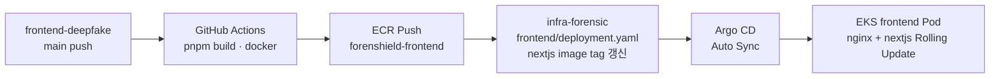

# 13. 프론트엔드 배포 가이드 — main + CI/CD + Argo CD (따라하기)

> **문서 시리즈:** [9. 백엔드·프론트 연결](./9.connect-backend-frontend.md) · [12. AI CI/CD](./12.ai-cicd-argocd-deploy.md) · [5. Frontend](./5.frontend-deploy.md)  
> **대상 코드:** `frontend/frontend-deepfake` (Next.js 16, **main** 브랜치)  
> **Infra 매니페스트:** `Infra/config/k8s/frontend/` → GitHub `infra-forensic` → Argo CD  
> **전제:** EKS · ECR · Ingress · Argo CD · 백엔드 배포 완료 ([9번 문서](./9.connect-backend-frontend.md) 기준)

`main` 브랜치 기준으로 Docker 이미지를 빌드하고, GitHub Actions가 ECR에 push한 뒤 **infra-forensic**의 Deployment image tag를 갱신하면 **Argo CD가 EKS에 자동 반영**합니다.

---

## 목차

- [0. 한눈에 보는 그림](#0-한눈에-보는-그림)
- [1. main 브랜치 맞추기](#1-main-브랜치-맞추기)
- [2. 수동 1회 빌드 테스트 (CI 전)](#2-수동-1회-빌드-테스트-ci-전)
- [3. 사전 확인 — ECR · K8s · Argo CD](#3-사전-확인--ecr--k8s--argo-cd)
- [4. AWS OIDC Role (1회 설정)](#4-aws-oidc-role-1회-설정)
- [5. GitHub Secrets (frontend-deepfake)](#5-github-secrets-frontend-deepfake)
- [6. GitHub Actions 워크플로 추가](#6-github-actions-워크플로-추가)
- [7. 첫 자동 배포 · 검증](#7-첫-자동-배포--검증)
- [8. 트러블슈팅](#8-트러블슈팅)
- [9. 전체 체크리스트](#9-전체-체크리스트)

---

## 0. 한눈에 보는 그림

### 0.1 배포 흐름 (GitOps)



### 0.2 사용자 트래픽

```text
브라우저
  └─ https://forensheildjangdochi.com
        └─ Ingress / ALB
              └─ frontend Service :80
                    ├─ nginx (사이드카)  /health
                    └─ nextjs :3000      Next.js standalone
```

### 0.3 역할 분담

| 구성요소 | 저장소 | 역할 |
|----------|--------|------|
| **앱 코드** | `sk-final-deepfake/frontend-deepfake` | Next.js 소스, Dockerfile, CI workflow |
| **K8s 매니페스트** | `sk-final-deepfake/infra-forensic` | Deployment · Service · nginx ConfigMap |
| **이미지** | ECR `forenshield-frontend` | 빌드된 컨테이너 |
| **배포 엔진** | Argo CD (`forenshield` Application) | Git watch → EKS Sync |

> **중요:** `NEXT_PUBLIC_API_URL`은 **빌드 타임**에 Docker 이미지에 박힙니다.  
> 런타임 ConfigMap(`frontend-config`)만 바꿔서는 API URL이 안 바뀝니다. **CI 빌드 시 `--build-arg`로 주입**해야 합니다.

---

## 1. main 브랜치 맞추기

로컬을 **원격 main과 동일**하게 맞춘 뒤 빌드·CI를 설정합니다.

```bash
cd frontend/frontend-deepfake

git fetch origin main
git checkout main
git reset --hard origin/main

# untracked까지 원격과 동일하게 (node_modules도 삭제됨 → 이후 pnpm install)
git clean -fd
```

브랜치 확인:

```bash
git branch --show-current   # main
git log -1 --oneline
```

> **참고:** 과거에 `develop`이 API 연동이 더 앞서 있었던 적이 있습니다.  
> **main 기준으로 배포**하기로 했다면 위 reset 후 main 코드로 진행하세요.  
> UI에 목데이터가 보이면 [9번 §9.6](./9.connect-backend-frontend.md#96-프론트엔드-docker배포) `recent-analyses.tsx` 브랜치 차이를 확인하세요.

---

## 2. 수동 1회 빌드 테스트 (CI 전)

CI 붙이기 전에 **로컬 PC에서** main 이미지가 빌드되는지 확인합니다.

### 2.1 변수

```bash
export AWS_PROFILE=forenshield          # PowerShell: $env:AWS_PROFILE="forenshield"
export AWS_REGION=ap-northeast-2
export ECR_REGISTRY=877044078824.dkr.ecr.ap-northeast-2.amazonaws.com
export IMAGE_TAG=manual-main-1

# API URL — 코드가 /api/... 를 붙이므로 도메인만 (끝에 /api 넣지 않음)
export NEXT_PUBLIC_API_URL=https://forensheildjangdochi.com
```

### 2.2 Docker 빌드 · 실행

```bash
cd frontend/frontend-deepfake

docker build \
  --build-arg NEXT_PUBLIC_API_URL=$NEXT_PUBLIC_API_URL \
  -t forenshield-frontend:$IMAGE_TAG .

docker run --rm -p 3000:3000 \
  -e HOSTNAME=0.0.0.0 \
  forenshield-frontend:$IMAGE_TAG
```

브라우저: `http://localhost:3000`

### 2.3 ECR Push (수동)

```bash
aws ecr get-login-password --region $AWS_REGION \
  | docker login --username AWS --password-stdin $ECR_REGISTRY

docker tag forenshield-frontend:$IMAGE_TAG \
  $ECR_REGISTRY/forenshield-frontend:$IMAGE_TAG
docker tag forenshield-frontend:$IMAGE_TAG \
  $ECR_REGISTRY/forenshield-frontend:latest
docker push $ECR_REGISTRY/forenshield-frontend:$IMAGE_TAG
docker push $ECR_REGISTRY/forenshield-frontend:latest
```

### 2.4 (선택) 수동으로 Pod 재시작

Argo CD Auto Sync 전 테스트용:

```bash
kubectl set image deployment/frontend \
  nextjs=$ECR_REGISTRY/forenshield-frontend:$IMAGE_TAG \
  -n forenshield
kubectl rollout status deployment/frontend -n forenshield --timeout=300s
kubectl get pods -n forenshield -l app=frontend   # READY 2/2
```

---

## 3. 사전 확인 — ECR · K8s · Argo CD

### 3.1 ECR 레포

```bash
aws ecr describe-repositories --repository-names forenshield-frontend
```

없을 때만:

```bash
aws ecr create-repository \
  --repository-name forenshield-frontend \
  --image-scanning-configuration scanOnPush=true \
  --region ap-northeast-2
```

### 3.2 infra-forensic 매니페스트 (이미 있어야 함)

```text
Infra/config/k8s/frontend/
├── deployment.yaml    # nginx + nextjs, nodegroup: frontend-ng
├── service.yaml
└── nginx-config.yaml
```

```bash
kubectl get deployment,svc,configmap -n forenshield | grep -E 'frontend|nginx-config'
```

`deployment.yaml`의 nextjs 이미지 줄 (ECR `repositoryUri` + 태그):

```yaml
- name: nextjs
  image: 877044078824.dkr.ecr.ap-northeast-2.amazonaws.com/forenshield-frontend:latest
```

> ECR 확인: `aws ecr describe-repositories --repository-names forenshield-frontend`  
> → `repositoryUri` + `:latest` 또는 CI가 push한 `:<git-sha>`  
> 수동 빌드 시: `:manual-main-1` 등 push한 태그와 **동일**하게 맞출 것

### 3.3 Argo CD Auto Sync

`Infra/config/argocd/argocd-app.yaml`에 아래가 있어야 합니다:

```yaml
  syncPolicy:
    automated:
      prune: true
      selfHeal: true
```

```bash
kubectl get application forenshield -n argocd
# Synced · Healthy
```

UI: `https://argocd.forensheildjangdochi.com`

---

## 4. AWS OIDC Role (1회 설정)

GitHub Actions가 **Access Key 없이** ECR에 push하도록 IAM Role을 만듭니다.  
(AI용 `forenshield-ai-forensic-github-actions`와 **별도 Role** 권장)

### 4.1 변수

```bash
export AWS_PROFILE=forenshield
export AWS_ACCOUNT_ID=877044078824
export ROLE_NAME=forenshield-frontend-github-actions
export GITHUB_ORG=sk-final-deepfake
export GITHUB_REPO=frontend-deepfake
```

### 4.2 GitHub OIDC Provider (없을 때만)

```bash
aws iam create-open-id-connect-provider \
  --url https://token.actions.githubusercontent.com \
  --client-id-list sts.amazonaws.com \
  --thumbprint-list 6938fd4d98bab03f6bdc70ef7a7d82714ce92169 \
  2>/dev/null || echo "OIDC provider already exists"
```

### 4.3 Trust Policy · Role 생성

```bash
cat > /tmp/trust-github-frontend.json << EOF
{
  "Version": "2012-10-17",
  "Statement": [
    {
      "Effect": "Allow",
      "Principal": {
        "Federated": "arn:aws:iam::${AWS_ACCOUNT_ID}:oidc-provider/token.actions.githubusercontent.com"
      },
      "Action": "sts:AssumeRoleWithWebIdentity",
      "Condition": {
        "StringEquals": {
          "token.actions.githubusercontent.com:aud": "sts.amazonaws.com"
        },
        "StringLike": {
          "token.actions.githubusercontent.com:sub": "repo:${GITHUB_ORG}/${GITHUB_REPO}:ref:refs/heads/main"
        }
      }
    }
  ]
}
EOF

aws iam create-role \
  --role-name "$ROLE_NAME" \
  --assume-role-policy-document file:///tmp/trust-github-frontend.json \
  --description "GitHub Actions OIDC for frontend-deepfake main CI/CD" \
  2>/dev/null || aws iam update-assume-role-policy \
    --role-name "$ROLE_NAME" \
    --policy-document file:///tmp/trust-github-frontend.json

aws iam attach-role-policy \
  --role-name "$ROLE_NAME" \
  --policy-arn arn:aws:iam::aws:policy/AmazonEC2ContainerRegistryPowerUser

aws iam get-role --role-name "$ROLE_NAME" --query 'Role.Arn' --output text
```

출력 ARN을 복사 → GitHub Secret `AWS_ROLE_ARN`에 사용:

```text
arn:aws:iam::877044078824:role/forenshield-frontend-github-actions
```

> GitOps만 쓰면 **EKS/kubectl 권한 불필요**. AI 때처럼 `kubectl rollout` step 넣지 마세요.

---

## 5. GitHub Secrets (frontend-deepfake)

**저장소:** `https://github.com/sk-final-deepfake/frontend-deepfake`  
**Settings → Secrets and variables → Actions**

| Secret | 값 | 설명 |
|--------|-----|------|
| `AWS_ROLE_ARN` | `arn:aws:iam::877044078824:role/forenshield-frontend-github-actions` | OIDC Role ARN (§4.3) |
| `AWS_REGION` | `ap-northeast-2` | |
| `INFRA_REPO_TOKEN` | GitHub PAT (`ghp_...`) | `infra-forensic` **repo** scope (read+write) |
| `NEXT_PUBLIC_API_URL` | `https://forensheildjangdochi.com` | Docker build-arg (끝에 `/api` 없음) |

### INFRA_REPO_TOKEN 만들기

1. GitHub → **Settings → Developer settings → Personal access tokens**
2. Classic: **`repo`** 체크 (private `infra-forensic` push용)
3. 토큰 복사 → `INFRA_REPO_TOKEN` Secret 등록

조직 SSO 사용 시 토큰 **Authorize** 필요.

CLI (`gh`):

```bash
gh secret set AWS_ROLE_ARN --repo sk-final-deepfake/frontend-deepfake \
  --body "arn:aws:iam::877044078824:role/forenshield-frontend-github-actions"
gh secret set AWS_REGION --repo sk-final-deepfake/frontend-deepfake --body "ap-northeast-2"
gh secret set NEXT_PUBLIC_API_URL --repo sk-final-deepfake/frontend-deepfake \
  --body "https://forensheildjangdochi.com"
gh secret set INFRA_REPO_TOKEN --repo sk-final-deepfake/frontend-deepfake --body "ghp_xxxx"
```

---

## 6. GitHub Actions 워크플로 추가

`frontend-deepfake/.github/workflows/deploy.yml` 생성 후 **main에 push**.

```yaml
name: Frontend Deploy (ECR + Argo CD GitOps)

on:
  push:
    branches: [main]
  workflow_dispatch:

permissions:
  id-token: write
  contents: read

env:
  AWS_REGION: ap-northeast-2
  ECR_REPOSITORY: forenshield-frontend
  INFRA_REPO: sk-final-deepfake/infra-forensic
  DEPLOYMENT_PATH: config/k8s/frontend/deployment.yaml

jobs:
  deploy:
    runs-on: ubuntu-latest
    steps:
      - name: Checkout frontend-deepfake
        uses: actions/checkout@v4

      - name: Configure AWS credentials (OIDC)
        uses: aws-actions/configure-aws-credentials@v4
        with:
          role-to-assume: ${{ secrets.AWS_ROLE_ARN }}
          aws-region: ${{ env.AWS_REGION }}

      - name: Login to ECR
        id: ecr
        uses: aws-actions/amazon-ecr-login@v2

      - name: Build and push Docker image
        env:
          IMAGE_TAG: ${{ github.sha }}
          ECR_REGISTRY: ${{ steps.ecr.outputs.registry }}
          NEXT_PUBLIC_API_URL: ${{ secrets.NEXT_PUBLIC_API_URL }}
        run: |
          docker build \
            --build-arg NEXT_PUBLIC_API_URL=$NEXT_PUBLIC_API_URL \
            -t $ECR_REGISTRY/$ECR_REPOSITORY:$IMAGE_TAG \
            -t $ECR_REGISTRY/$ECR_REPOSITORY:latest \
            .
          docker push $ECR_REGISTRY/$ECR_REPOSITORY:$IMAGE_TAG
          docker push $ECR_REGISTRY/$ECR_REPOSITORY:latest

      - name: Checkout infra-forensic
        uses: actions/checkout@v4
        with:
          repository: ${{ env.INFRA_REPO }}
          token: ${{ secrets.INFRA_REPO_TOKEN }}
          path: infra

      - name: Update nextjs image tag in deployment manifest
        env:
          IMAGE_TAG: ${{ github.sha }}
          ECR_REGISTRY: ${{ steps.ecr.outputs.registry }}
        run: |
          NEW_IMAGE="$ECR_REGISTRY/$ECR_REPOSITORY:$IMAGE_TAG"
          FILE="infra/$DEPLOYMENT_PATH"
          # nextjs 컨테이너 image 줄만 교체 (nginx:alpine 은 유지)
          sed -i "/name: nextjs/,/image:/ s|image: .*forenshield-frontend:.*|image: $NEW_IMAGE|" "$FILE"
          grep -A1 "name: nextjs" "$FILE"

      - name: Push to infra-forensic (triggers Argo CD)
        working-directory: infra
        run: |
          git config user.name "github-actions[bot]"
          git config user.email "github-actions[bot]@users.noreply.github.com"
          git add $DEPLOYMENT_PATH
          git diff --staged --quiet && echo "No manifest change" && exit 0
          git commit -m "ci: frontend nextjs image → ${{ github.sha }}"
          git push origin master

      # GitOps: Argo CD Auto Sync가 frontend Pod Rolling Update 수행
```

커밋 · push:

```bash
cd frontend/frontend-deepfake
git add .github/workflows/deploy.yml
git commit -m "ci: add GitOps deploy workflow (main → ECR → Argo CD)"
git push origin main
```

---

## 7. 첫 자동 배포 · 검증

### 7.1 GitHub Actions 확인

`frontend-deepfake` → **Actions** 탭 → workflow **초록색** 확인

단계별 기대:
1. Docker build + ECR push ✅
2. infra-forensic `deployment.yaml` image tag 갱신 commit ✅
3. Argo CD Sync (1~2분) ✅

### 7.2 Argo CD

```bash
kubectl get application forenshield -n argocd
# Synced · Healthy
```

UI에서 `frontend` Deployment **Synced** 확인.

### 7.3 Pod · 서비스

```bash
kubectl get pods -n forenshield -l app=frontend
# READY 2/2 (nginx + nextjs)

kubectl logs -n forenshield deployment/frontend -c nextjs --tail=30
kubectl logs -n forenshield deployment/frontend -c nginx --tail=10
```

### 7.4 외부 URL

| # | 확인 | 기대 |
|---|------|------|
| 1 | `curl https://forensheildjangdochi.com/health` | `ok` |
| 2 | `curl -I https://forensheildjangdochi.com/` | 200 또는 307 → `/main` |
| 3 | 브라우저 메인 UI | 렌더링, DevTools CORS 에러 없음 |
| 4 | 파일 업로드 (UI) | 200, S3 저장 |

---

## 8. 트러블슈팅

| 증상 | 원인 | 해결 |
|------|------|------|
| Docker build `ERR_PNPM_IGNORED_BUILDS` | pnpm 11 strictDepBuilds | `Dockerfile` `node:22-alpine` + `pnpm-workspace.yaml` ([9번 §9.6](./9.connect-backend-frontend.md)) |
| Ingress / nginx **502** | Next.js HOSTNAME 바인딩 | `deployment.yaml`에 `HOSTNAME: "0.0.0.0"` ([9번](./9.connect-backend-frontend.md)) |
| API 호출 404 / CORS | `NEXT_PUBLIC_API_URL` 잘못됨 | Secret을 `https://forensheildjangdochi.com` 로 ( `/api` 접미사 ❌ ) → **재빌드** |
| `ImagePullBackOff` | ECR tag 없음 | Actions ECR push 로그 확인 |
| Argo CD `OutOfSync` | infra push 실패 | `INFRA_REPO_TOKEN` 권한, `master` 브랜치명 |
| CI `AccessDenied` ECR | OIDC Role 없음/ trust 오류 | §4 Role · `main` 브랜치 trust 조건 |
| CI infra push 403 | PAT 만료/권한 | Classic `repo` 또는 fine-grained Contents write |
| Pod Pending | `frontend-ng` 없음 | `kubectl get nodes -L nodegroup` |
| UI 목데이터만 보임 | main 코드 상태 | `recent-analyses.tsx` API 연동 여부 확인 |

롤백:

```bash
# Argo CD / Git — infra-forensic에서 이전 image tag로 revert 후 push
# 또는 로컬
kubectl rollout undo deployment/frontend -n forenshield
```

---

## 9. 전체 체크리스트

### 준비

- [ ] `frontend-deepfake` 로컬 `main` = `origin/main` (`git reset --hard`)
- [ ] 수동 `docker build` 성공
- [ ] ECR `forenshield-frontend` 존재
- [ ] `config/k8s/frontend/` infra-forensic에 push됨
- [ ] Argo CD `automated` sync 활성화

### AWS · GitHub

- [ ] IAM Role `forenshield-frontend-github-actions` + ECR PowerUser
- [ ] GitHub OIDC Provider 등록
- [ ] Secrets 4개: `AWS_ROLE_ARN`, `AWS_REGION`, `INFRA_REPO_TOKEN`, `NEXT_PUBLIC_API_URL`
- [ ] `.github/workflows/deploy.yml` main push

### 배포 후

- [ ] Actions workflow 성공
- [ ] infra-forensic에 `ci: frontend nextjs image → ...` 커밋 생성
- [ ] Argo CD Synced
- [ ] Pod READY 2/2
- [ ] `https://forensheildjangdochi.com/health` → `ok`
- [ ] UI · 업로드 E2E OK

---

## 부록 — AI CI/CD(12번)와 비교

| 항목 | AI (`ai-forensic`) | Frontend (`frontend-deepfake`) |
|------|-------------------|-------------------------------|
| 트리거 브랜치 | `main` | `main` |
| ECR 레포 | `forenshield-ai-fastapi` | `forenshield-frontend` |
| 매니페스트 경로 | `config/k8s/ai-fastapi/deployment.yaml` | `config/k8s/frontend/deployment.yaml` |
| image 교체 대상 | `ai-fastapi` 컨테이너 | **`nextjs` 컨테이너만** (nginx 유지) |
| 빌드 특이사항 | Python | `--build-arg NEXT_PUBLIC_API_URL` 필수 |
| kubectl rollout | 생략 (GitOps) | 생략 (GitOps) |

---

**다음:** 백엔드도 동일 GitOps 패턴이 필요하면 `forenshield-backend-github-actions` Role + `config/k8s/backend/deployment.yaml` 갱신 workflow를 같은 방식으로 추가하면 됩니다.
