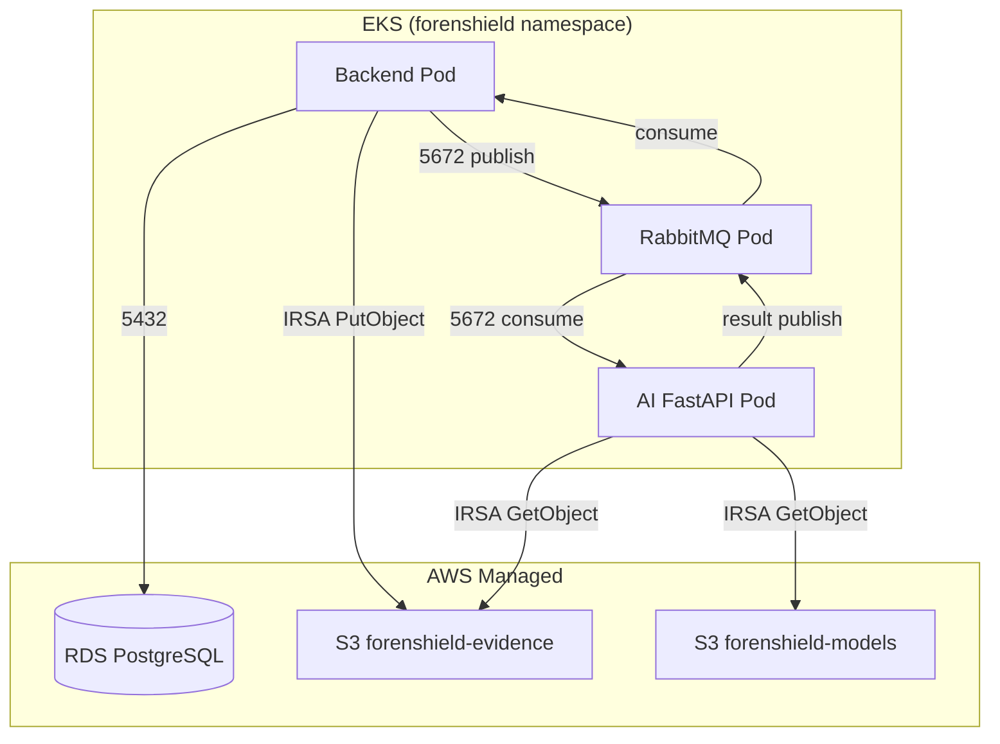

# ForenShield AI — 데이터 레이어 배포 가이드 (Sprint 4)

> **문서 시리즈:** [README](./README.md) · **다음:** [7. AI](./7.ai-deploy.md)  
> **대상:** Backend · AI FastAPI · DevOps  
> **관련 문서:** [2. Terraform architecture](./2.Terraform%20architecture.md) · [3. Settings](./3.settings.md)  
> **Namespace:** `forenshield` · **리전:** `ap-northeast-2`

PostgreSQL(RDS), RabbitMQ(EKS), S3(증거·모델) 세 서비스의 배포·연결·검증 절차를 정리합니다.

---

## 목차

1. [아키텍처 개요](#1-아키텍처-개요)
2. [구축 순서](#2-구축-순서)
3. [PostgreSQL (RDS)](#3-postgresql-rds)
4. [RabbitMQ](#4-rabbitmq)
5. [Amazon S3](#5-amazon-s3)
6. [K8s Secret · ConfigMap 통합](#6-k8s-secret--configmap-통합)
7. [애플리케이션 연결](#7-애플리케이션-연결)
8. [연결 검증](#8-연결-검증)
9. [트러블슈팅](#9-트러블슈팅)
10. [진행 체크리스트](#10-진행-체크리스트)

---

## 1. 아키텍처 개요

### 1.1 세 서비스의 역할

| 서비스 | 유형 | 역할 | 주요 사용 주체 |
|--------|------|------|----------------|
| PostgreSQL | AWS RDS (관리형) | 사건·감사로그·분석결과 메타데이터 영구 저장 | Backend (Spring Boot) |
| RabbitMQ | EKS Pod (자체 호스팅) | 분석 요청·결과 비동기 중계 | Backend (publish), AI FastAPI (consume) |
| S3 | AWS S3 (관리형) | 증거 원본(WORM)·AI 모델 파일 저장 | Backend (upload), AI FastAPI/GPU (download) |

### 1.2 연결 관계도



### 1.3 네트워크 · 보안 요약

| 서비스 | 위치 | 포트 | Security Group / NetworkPolicy |
|--------|------|------|--------------------------------|
| PostgreSQL | Data Subnet (Private) | 5432 | `sg-rds` ← EKS Node SG |
| RabbitMQ | backend-ng (Private) | 5672, 15672 | Backend·AI Pod → RabbitMQ Pod |
| S3 | VPC Endpoint (Gateway) | 443 | IRSA Role 기반, NAT 불필요 |

---

## 2. 구축 순서

### 2.1 Phase 3 (AWS 인프라) — 앱 배포 전

```text
VPC / Subnet
 └─ Security Group
      └─ VPC Endpoint (S3)
           └─ S3 버킷 생성
                └─ RDS PostgreSQL 생성
```

### 2.2 Phase 4 (K8s) — 앱 배포 전

```text
Namespace 생성
 └─ Secret · ConfigMap 생성
      └─ RabbitMQ Pod 배포
           └─ Queue/Exchange 생성
                └─ Backend · AI FastAPI 배포 (각 앱 가이드)
```

### 2.3 선행 조건

| # | 항목 | 확인 |
|---|------|------|
| 1 | EKS Cluster `forenshield` | `kubectl get nodes` |
| 2 | Data Subnet (RDS용) | `10.0.20.0/24`, `10.0.21.0/24` |
| 3 | Private Subnet (EKS용) | `10.0.10.0/24`, `10.0.11.0/24` |
| 4 | backend-ng Node Group | RabbitMQ·Backend 배치 |
| 5 | VPC S3 Gateway Endpoint | Private Route Table 연결 |

---

## 3. PostgreSQL (RDS)

### 3.1 RDS 사양

| 항목 | 값 |
|------|-----|
| 엔진 | PostgreSQL 16 (또는 15+) |
| 인스턴스 | `db.t3.medium` |
| 스토리지 | 20 GB gp3 |
| Subnet | Data Subnet (Multi-AZ 선택) |
| DB 이름 | `forenshield` |
| 마스터 사용자 | `forenshield` |
| SG | `sg-rds` — EKS Node SG에서 5432 허용 |

### 3.2 RDS 생성 (AWS CLI 예시)

```bash
export AWS_REGION=ap-northeast-2
export DB_PASSWORD='<강력한_비밀번호>'

aws rds create-db-instance \
  --db-instance-identifier forenshield-db \
  --db-instance-class db.t3.medium \
  --engine postgres \
  --engine-version 16.4 \
  --master-username forenshield \
  --master-user-password "$DB_PASSWORD" \
  --allocated-storage 20 \
  --db-name forenshield \
  --vpc-security-group-ids <SG_RDS_ID> \
  --db-subnet-group-name forenshield-data-subnet-group \
  --no-publicly-accessible \
  --backup-retention-period 7 \
  --tags Key=Project,Value=forenshield
```

### 3.3 RDS 엔드포인트 확인

```bash
aws rds describe-db-instances \
  --db-instance-identifier forenshield-db \
  --query 'DBInstances[0].Endpoint.Address' \
  --output text
# 예: forenshield-db.xxxxx.ap-northeast-2.rds.amazonaws.com
```

### 3.4 Security Group

| SG | 인바운드 규칙 |
|----|---------------|
| `sg-rds` | TCP 5432 ← `sg-eks-node` (EKS Worker SG) |

```bash
aws ec2 authorize-security-group-ingress \
  --group-id <SG_RDS_ID> \
  --protocol tcp \
  --port 5432 \
  --source-group <SG_EKS_NODE_ID>
```

### 3.5 DB 연결 테스트

```bash
# EKS debug Pod 또는 SSM Bastion에서
psql -h <RDS_ENDPOINT> -U forenshield -d forenshield -c "SELECT 1;"
# 기대: 1 row
```

### 3.6 K8s Secret 등록

```bash
kubectl create secret generic db-credentials -n forenshield \
  --from-literal=POSTGRES_HOST=<RDS_ENDPOINT> \
  --from-literal=POSTGRES_USER=forenshield \
  --from-literal=POSTGRES_PASSWORD=<PASSWORD> \
  --from-literal=POSTGRES_DB=forenshield
```

### 3.7 Backend 연결 설정

`application-prod.yml` (Spring Boot):

```yaml
spring:
  datasource:
    url: jdbc:postgresql://${POSTGRES_HOST}:5432/${POSTGRES_DB:forenshield}
    username: ${POSTGRES_USER}
    password: ${POSTGRES_PASSWORD}
    driver-class-name: org.postgresql.Driver
  jpa:
    hibernate:
      ddl-auto: validate   # 운영: validate 또는 none (Flyway 사용)
```

스키마 마이그레이션은 Flyway/Liquibase로 관리합니다. `ddl-auto: update`는 운영에서 사용하지 않습니다.

---

## 4. RabbitMQ

### 4.1 RabbitMQ 사양

| 항목 | 값 |
|------|-----|
| 배포 위치 | EKS backend-ng 노드 |
| 이미지 | `rabbitmq:3.13-management-alpine` |
| AMQP 포트 | 5672 |
| Management UI | 15672 (내부만, 외부 노출 금지) |
| 영속화 | PVC (권장) |

### 4.2 K8s 매니페스트

`k8s/rabbitmq/secret.yaml` (또는 `kubectl create`):

```yaml
apiVersion: v1
kind: Secret
metadata:
  name: rabbitmq-credentials
  namespace: forenshield
type: Opaque
stringData:
  RABBITMQ_USER: forenshield
  RABBITMQ_PASSWORD: <PASSWORD>
  RABBITMQ_ERLANG_COOKIE: <RANDOM_COOKIE>
```

`k8s/rabbitmq/deployment.yaml`:

```yaml
apiVersion: apps/v1
kind: Deployment
metadata:
  name: rabbitmq
  namespace: forenshield
  labels:
    app: rabbitmq
spec:
  replicas: 1
  selector:
    matchLabels:
      app: rabbitmq
  template:
    metadata:
      labels:
        app: rabbitmq
    spec:
      nodeSelector:
        nodegroup: backend-ng
      containers:
        - name: rabbitmq
          image: rabbitmq:3.13-management-alpine
          ports:
            - name: amqp
              containerPort: 5672
            - name: management
              containerPort: 15672
          env:
            - name: RABBITMQ_DEFAULT_USER
              valueFrom:
                secretKeyRef:
                  name: rabbitmq-credentials
                  key: RABBITMQ_USER
            - name: RABBITMQ_DEFAULT_PASS
              valueFrom:
                secretKeyRef:
                  name: rabbitmq-credentials
                  key: RABBITMQ_PASSWORD
          volumeMounts:
            - name: rabbitmq-data
              mountPath: /var/lib/rabbitmq
          readinessProbe:
            exec:
              command: ["rabbitmq-diagnostics", "check_running"]
            initialDelaySeconds: 20
            periodSeconds: 10
          livenessProbe:
            exec:
              command: ["rabbitmq-diagnostics", "check_running"]
            initialDelaySeconds: 60
            periodSeconds: 30
          resources:
            requests:
              cpu: 200m
              memory: 512Mi
            limits:
              cpu: 500m
              memory: 1Gi
      volumes:
        - name: rabbitmq-data
          persistentVolumeClaim:
            claimName: rabbitmq-pvc
```

`k8s/rabbitmq/pvc.yaml`:

```yaml
apiVersion: v1
kind: PersistentVolumeClaim
metadata:
  name: rabbitmq-pvc
  namespace: forenshield
spec:
  accessModes:
    - ReadWriteOnce
  resources:
    requests:
      storage: 5Gi
```

`k8s/rabbitmq/service.yaml`:

```yaml
apiVersion: v1
kind: Service
metadata:
  name: rabbitmq
  namespace: forenshield
  labels:
    app: rabbitmq
spec:
  type: ClusterIP
  selector:
    app: rabbitmq
  ports:
    - name: amqp
      port: 5672
      targetPort: 5672
    - name: management
      port: 15672
      targetPort: 15672
```

### 4.3 RabbitMQ 배포

```bash
kubectl apply -f k8s/rabbitmq/ -n forenshield
kubectl get pods -n forenshield -l app=rabbitmq -w
kubectl get svc rabbitmq -n forenshield
```

### 4.4 Queue · Exchange 생성

ForenShield AI 분석 파이프라인용 큐 정의:

| 리소스 | 이름 | 용도 | 생산자 | 소비자 |
|--------|------|------|--------|--------|
| Queue | `analysis.request` | 분석 요청 | Backend | AI FastAPI |
| Queue | `analysis.result` | 분석 결과 | AI FastAPI | Backend |
| Exchange | `forenshield.analysis` | topic (선택) | — | — |

```bash
# RabbitMQ Pod 내부에서 실행
kubectl exec -it -n forenshield deploy/rabbitmq -- bash

rabbitmqadmin declare queue name=analysis.request durable=true
rabbitmqadmin declare queue name=analysis.result durable=true
rabbitmqadmin declare exchange name=forenshield.analysis type=topic durable=true
rabbitmqadmin declare binding source=forenshield.analysis destination=analysis.request routing_key=analysis.request
rabbitmqadmin declare binding source=forenshield.analysis destination=analysis.result routing_key=analysis.result
```

### 4.5 ConfigMap (호스트 정보)

```bash
kubectl create configmap rabbitmq-config -n forenshield \
  --from-literal=RABBITMQ_HOST=rabbitmq.forenshield.svc.cluster.local \
  --from-literal=RABBITMQ_PORT=5672 \
  --from-literal=RABBITMQ_QUEUE_REQUEST=analysis.request \
  --from-literal=RABBITMQ_QUEUE_RESULT=analysis.result
```

### 4.6 애플리케이션 연결 정보

| Pod | 연결 방식 | 환경변수 |
|-----|-----------|----------|
| Backend | AMQP publish | `RABBITMQ_HOST`, `RABBITMQ_USER`, `RABBITMQ_PASSWORD` |
| AI FastAPI | AMQP consume/publish | 동일 Secret + `RABBITMQ_QUEUE_*` ConfigMap |

Spring Boot (`application-prod.yml`):

```yaml
spring:
  rabbitmq:
    host: ${RABBITMQ_HOST}
    port: 5672
    username: ${RABBITMQ_USER}
    password: ${RABBITMQ_PASSWORD}
```

AI FastAPI (환경변수):

```bash
RABBITMQ_HOST=rabbitmq.forenshield.svc.cluster.local
RABBITMQ_USER=forenshield
RABBITMQ_PASSWORD=<PASSWORD>
RABBITMQ_QUEUE_REQUEST=analysis.request
RABBITMQ_QUEUE_RESULT=analysis.result
```

### 4.7 RabbitMQ 연결 테스트

```bash
# Pod 상태
kubectl get pods -n forenshield -l app=rabbitmq

# AMQP 포트 확인 (debug Pod)
kubectl run mq-test --rm -it --image=busybox --restart=Never -n forenshield -- \
  nc -zv rabbitmq.forenshield.svc.cluster.local 5672

# Management UI (port-forward, 내부 디버그용)
kubectl port-forward svc/rabbitmq 15672:15672 -n forenshield
# 브라우저: http://localhost:15672 (forenshield / <PASSWORD>)
```

---

## 5. Amazon S3

### 5.1 버킷 구성

| 버킷 | 용도 | 특수 설정 | 접근 주체 |
|------|------|-----------|-----------|
| `forenshield-evidence` | 증거 원본 (WORM) | Object Lock, 버전 관리 | Backend (Put), AI/GPU (Get) |
| `forenshield-models` | AI 모델 파일 | 버전 관리 (`v1.0/`) | AI FastAPI/GPU (Get) |

### 5.2 VPC Endpoint (S3 Gateway)

Private Subnet의 Pod가 NAT 없이 S3에 접근하도록 Gateway Endpoint를 생성합니다.

```bash
aws ec2 create-vpc-endpoint \
  --vpc-id <VPC_ID> \
  --service-name com.amazonaws.ap-northeast-2.s3 \
  --route-table-ids <PRIVATE_RT_ID> <DATA_RT_ID>
```

검증:

```bash
aws ec2 describe-vpc-endpoints \
  --filters "Name=service-name,Values=com.amazonaws.ap-northeast-2.s3"
```

### 5.3 S3 버킷 생성

증거 버킷 (WORM):

```bash
aws s3api create-bucket \
  --bucket forenshield-evidence \
  --region ap-northeast-2 \
  --create-bucket-configuration LocationConstraint=ap-northeast-2

# 버전 관리
aws s3api put-bucket-versioning \
  --bucket forenshield-evidence \
  --versioning-configuration Status=Enabled

# Object Lock (버킷 생성 시 활성화 필요 — 신규 버킷만 가능)
aws s3api put-object-lock-configuration \
  --bucket forenshield-evidence \
  --object-lock-configuration '{"ObjectLockEnabled":"Enabled","Rule":{"DefaultRetention":{"Mode":"COMPLIANCE","Days":365}}}'
```

모델 버킷:

```bash
aws s3api create-bucket \
  --bucket forenshield-models \
  --region ap-northeast-2 \
  --create-bucket-configuration LocationConstraint=ap-northeast-2

aws s3api put-bucket-versioning \
  --bucket forenshield-models \
  --versioning-configuration Status=Enabled
```

### 5.4 버킷 정책 (VPC Endpoint 제한 — 권장)

```json
{
  "Version": "2012-10-17",
  "Statement": [
    {
      "Sid": "AllowVPCEndpointOnly",
      "Effect": "Deny",
      "Principal": "*",
      "Action": "s3:*",
      "Resource": [
        "arn:aws:s3:::forenshield-evidence",
        "arn:aws:s3:::forenshield-evidence/*"
      ],
      "Condition": {
        "StringNotEquals": {
          "aws:sourceVpce": "<VPC_ENDPOINT_ID>"
        }
      }
    }
  ]
}
```

### 5.5 IRSA — Pod별 S3 권한

Access Key 사용 금지. EKS OIDC + ServiceAccount로 Role을 연결합니다.

**Backend Role (Read + Write — evidence)**

| 권한 | Action |
|------|--------|
| 증거 업로드 | `s3:PutObject`, `s3:GetObject`, `s3:ListBucket` |

```json
{
  "Version": "2012-10-17",
  "Statement": [
    {
      "Effect": "Allow",
      "Action": ["s3:PutObject", "s3:GetObject", "s3:ListBucket"],
      "Resource": [
        "arn:aws:s3:::forenshield-evidence",
        "arn:aws:s3:::forenshield-evidence/*"
      ]
    }
  ]
}
```

ServiceAccount:

```yaml
apiVersion: v1
kind: ServiceAccount
metadata:
  name: backend-sa
  namespace: forenshield
  annotations:
    eks.amazonaws.com/role-arn: arn:aws:iam::<AWS_ACCOUNT_ID>:role/forenshield-backend-s3-role
```

**AI FastAPI Role (Read Only — evidence + models)**

```json
{
  "Version": "2012-10-17",
  "Statement": [
    {
      "Effect": "Allow",
      "Action": ["s3:GetObject", "s3:ListBucket"],
      "Resource": [
        "arn:aws:s3:::forenshield-evidence",
        "arn:aws:s3:::forenshield-evidence/*",
        "arn:aws:s3:::forenshield-models",
        "arn:aws:s3:::forenshield-models/*"
      ]
    }
  ]
}
```

**On-Prem GPU Gateway (Read Only)**

| 단계 | 방식 |
|------|------|
| Phase 1 테스트 | IAM User Access Key (임시, 테스트 후 삭제) |
| 운영 | IAM Role + VPN 또는 Instance Profile |

### 5.6 K8s Secret · ConfigMap (S3)

```bash
kubectl create secret generic s3-config -n forenshield \
  --from-literal=S3_EVIDENCE_BUCKET=forenshield-evidence \
  --from-literal=S3_MODELS_BUCKET=forenshield-models \
  --from-literal=AWS_REGION=ap-northeast-2 \
  --from-literal=MODEL_VERSION=v1.0
```

### 5.7 애플리케이션 연결

Backend (Spring Boot + AWS SDK):

```yaml
aws:
  region: ${AWS_REGION:ap-northeast-2}
  s3:
    evidence-bucket: ${S3_EVIDENCE_BUCKET:forenshield-evidence}
```

Pod에 `backend-sa` ServiceAccount를 지정하면 SDK가 IRSA credentials를 자동 사용합니다.

AI FastAPI (boto3):

```python
import boto3
import os

s3 = boto3.client("s3", region_name=os.environ["AWS_REGION"])
bucket = os.environ["S3_EVIDENCE_BUCKET"]
s3.list_objects_v2(Bucket=bucket, MaxKeys=1)
```

### 5.8 S3 연결 테스트

```bash
# AWS CLI (로컬 또는 debug Pod with IRSA)
aws s3 ls s3://forenshield-evidence/
aws s3 ls s3://forenshield-models/v1.0/

# EKS Pod에서 IRSA 테스트 (backend-sa 사용 Pod)
kubectl run s3-test --rm -it \
  --image=amazon/aws-cli \
  --serviceaccount=backend-sa \
  --restart=Never -n forenshield -- \
  s3 ls s3://forenshield-evidence/
```

---

## 6. K8s Secret · ConfigMap 통합

### 6.1 Secret 목록

| Secret 이름 | 키 | 사용 Pod |
|-------------|-----|----------|
| `db-credentials` | `POSTGRES_HOST`, `POSTGRES_USER`, `POSTGRES_PASSWORD`, `POSTGRES_DB` | Backend |
| `rabbitmq-credentials` | `RABBITMQ_USER`, `RABBITMQ_PASSWORD` | Backend, AI FastAPI, RabbitMQ |
| `s3-config` | `S3_EVIDENCE_BUCKET`, `S3_MODELS_BUCKET`, `AWS_REGION` | Backend, AI FastAPI |

### 6.2 ConfigMap 목록

| ConfigMap 이름 | 키 | 사용 Pod |
|----------------|-----|----------|
| `rabbitmq-config` | `RABBITMQ_HOST`, `RABBITMQ_QUEUE_*` | Backend, AI FastAPI |
| `backend-config` | `SPRING_PROFILES_ACTIVE`, `SERVER_PORT` | Backend |
| `ai-fastapi-config` | `AI_GATEWAY_URL`, `MODEL_VERSION` | AI FastAPI |

### 6.3 일괄 Secret 생성 스크립트

```bash
#!/bin/bash
# create-secrets.sh — 값을 환경변수로 주입 후 실행 (Git 커밋 금지)

kubectl create namespace forenshield --dry-run=client -o yaml | kubectl apply -f -

kubectl create secret generic db-credentials -n forenshield \
  --from-literal=POSTGRES_HOST="$RDS_ENDPOINT" \
  --from-literal=POSTGRES_USER=forenshield \
  --from-literal=POSTGRES_PASSWORD="$DB_PASSWORD" \
  --from-literal=POSTGRES_DB=forenshield \
  --dry-run=client -o yaml | kubectl apply -f -

kubectl create secret generic rabbitmq-credentials -n forenshield \
  --from-literal=RABBITMQ_USER=forenshield \
  --from-literal=RABBITMQ_PASSWORD="$MQ_PASSWORD" \
  --from-literal=RABBITMQ_ERLANG_COOKIE="$MQ_COOKIE" \
  --dry-run=client -o yaml | kubectl apply -f -

kubectl create secret generic s3-config -n forenshield \
  --from-literal=S3_EVIDENCE_BUCKET=forenshield-evidence \
  --from-literal=S3_MODELS_BUCKET=forenshield-models \
  --from-literal=AWS_REGION=ap-northeast-2 \
  --dry-run=client -o yaml | kubectl apply -f -
```

### 6.4 Pod envFrom 연결 예시

```yaml
# Backend Deployment 일부
envFrom:
  - configMapRef:
      name: backend-config
  - configMapRef:
      name: rabbitmq-config
  - secretRef:
      name: db-credentials
  - secretRef:
      name: rabbitmq-credentials
  - secretRef:
      name: s3-config
```

---

## 7. 애플리케이션 연결

### 7.1 서비스별 연결 매트릭스

| Pod | PostgreSQL | RabbitMQ | S3 evidence | S3 models |
|-----|------------|----------|-------------|-----------|
| Backend | ✅ Read/Write | ✅ publish/consume | ✅ Put/Get | ❌ |
| AI FastAPI | ❌ | ✅ consume/publish | ✅ Get | ✅ Get |
| GPU Gateway | ❌ | ❌ | ✅ Get | ✅ Get |
| Frontend | ❌ | ❌ | ❌ | ❌ |

### 7.2 연결 순서 (앱 배포 시)

```text
1. Secret · ConfigMap apply
2. RabbitMQ Pod 배포 + Queue 생성
3. Backend Pod 배포 → RDS · RabbitMQ · S3 연결 확인
4. AI FastAPI Pod 배포 → RabbitMQ · S3 · GPU 연결 확인
```

### 7.3 관련 배포 가이드

| 앱 | 가이드 |
|----|--------|
| RabbitMQ 이후 Backend | [6. Backend](./6.backend-deploy.md) |
| RabbitMQ 이후 AI FastAPI | [7. AI](./7.ai-deploy.md) |
| 전체 파이프라인 | [README](./README.md) |

---

## 8. 연결 검증

### 8.1 계층별 검증 순서

```text
[1] RDS: psql SELECT 1
[2] S3: aws s3 ls (VPC Endpoint + IRSA)
[3] RabbitMQ: Pod Running + Queue 생성 + AMQP 포트
[4] Backend: /actuator/health (DB, Rabbit UP)
[5] AI FastAPI: /health + 큐 consume
[6] E2E: Backend → RabbitMQ → AI → GPU → result
```

### 8.2 PostgreSQL

```bash
kubectl run pg-test --rm -it --image=postgres:16-alpine --restart=Never -n forenshield -- \
  psql -h $RDS_ENDPOINT -U forenshield -d forenshield -c "SELECT 1;"
```

| 확인 | 기대 |
|------|------|
| TCP 5432 | 연결 성공 |
| `SELECT 1` | 1 row |
| Backend health | DB status UP |

### 8.3 RabbitMQ

```bash
kubectl get pods -n forenshield -l app=rabbitmq
kubectl exec -n forenshield deploy/rabbitmq -- rabbitmqctl list_queues
```

| 확인 | 기대 |
|------|------|
| Pod | Running |
| `analysis.request` | Queue 존재 |
| `analysis.result` | Queue 존재 |
| Backend publish | Queue에 메시지 적재 |

### 8.4 S3

```bash
aws s3 ls s3://forenshield-evidence/
aws s3api get-object-lock-configuration --bucket forenshield-evidence

# IRSA Pod 테스트
kubectl run s3-test --rm -it --image=amazon/aws-cli \
  --serviceaccount=backend-sa --restart=Never -n forenshield -- \
  s3 cp /dev/null s3://forenshield-evidence/test/connection-check.txt
```

| 확인 | 기대 |
|------|------|
| ListBucket | 객체 목록 또는 빈 버킷 |
| PutObject (Backend) | 업로드 성공 |
| Object Lock | COMPLIANCE 모드 적용 |
| GetObject (AI/GPU) | 다운로드 성공 |

### 8.5 통합 E2E

| # | 시나리오 | 기대 결과 |
|---|----------|-----------|
| 1 | 증거 업로드 API | S3 `forenshield-evidence`에 객체 생성 |
| 2 | DB 메타 저장 | RDS에 사건 레코드 INSERT |
| 3 | 분석 요청 | Backend → `analysis.request` publish |
| 4 | AI consume | AI FastAPI 로그에 메시지 수신 |
| 5 | 결과 반환 | `analysis.result` → Backend consume |

---

## 9. 트러블슈팅

| 증상 | 대상 | 원인 | 해결 |
|------|------|------|------|
| Connection refused 5432 | PostgreSQL | SG 미허용 | `sg-rds`에 EKS Node SG 추가 |
| password authentication failed | PostgreSQL | Secret 값 오류 | `db-credentials` 재생성 |
| Connection refused 5672 | RabbitMQ | Pod 미기동·DNS 오류 | `kubectl get pods`, `RABBITMQ_HOST` 확인 |
| Queue not found | RabbitMQ | Queue 미생성 | `rabbitmqadmin declare queue` 실행 |
| 메시지 미소비 | RabbitMQ | consumer 미기동·바인딩 오류 | AI FastAPI 로그, exchange binding 확인 |
| AccessDenied S3 | S3 | IRSA Role/policy | ServiceAccount annotation·IAM Policy |
| S3 timeout | S3 | VPC Endpoint 미연결 | Gateway Endpoint·Route Table 확인 |
| NAT 비용 과다 | S3 | Endpoint 없이 NAT 경유 | S3 Gateway Endpoint 생성 |
| WORM 삭제 실패 | S3 | Object Lock 정상 동작 | 의도된 동작 — retention 기간 확인 |

공통 디버그:

```bash
kubectl get secrets,configmaps -n forenshield
kubectl describe pod -n forenshield -l app=backend
kubectl logs -n forenshield -l app=rabbitmq --tail=100
aws rds describe-db-instances --db-instance-identifier forenshield-db
```

---

## 10. 진행 체크리스트

### PostgreSQL (RDS)

- [ ] Data Subnet Group 생성
- [ ] `sg-rds` (5432 ← EKS Node) 설정
- [ ] RDS `forenshield-db` 생성
- [ ] `psql SELECT 1` 성공
- [ ] `db-credentials` Secret 생성

### RabbitMQ

- [ ] `rabbitmq-credentials` Secret 생성
- [ ] PVC · Deployment · Service 배포
- [ ] Pod Running 확인
- [ ] `analysis.request` · `analysis.result` Queue 생성
- [ ] `rabbitmq-config` ConfigMap 생성
- [ ] AMQP 5672 포트 연결 확인

### S3

- [ ] S3 Gateway VPC Endpoint 생성
- [ ] `forenshield-evidence` 버킷 (WORM) 생성
- [ ] `forenshield-models` 버킷 생성
- [ ] Backend IRSA Role · `backend-sa` 설정
- [ ] AI FastAPI IRSA Role · `ai-fastapi-sa` 설정
- [ ] `s3-config` Secret 생성
- [ ] ListBucket · PutObject · GetObject 테스트

### 앱 연결

- [ ] Backend `/actuator/health` — DB · Rabbit UP
- [ ] Backend S3 증거 업로드 성공
- [ ] AI FastAPI RabbitMQ consume 확인
- [ ] AI FastAPI S3 GetObject 확인
- [ ] E2E: 분석 요청 → 큐 → AI → 결과
