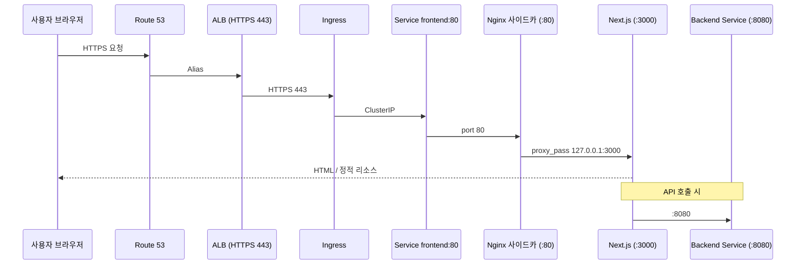

# ForenShield AI — 프론트엔드 배포 가이드 (Sprint 4)

> **대상:** EKS `forenshield` 네임스페이스 · `frontend-ng` Node Group · Next.js + Nginx 사이드카  
> **Namespace:** `forenshield`  
> **문서 시리즈:** [README](./README.md) · **관련:** [3. Settings](./3.settings.md) · [2. Terraform](./2.Terraform%20architecture.md) · [6. Backend](./6.backend-deploy.md)

Next.js 프론트엔드를 **Docker 이미지로 빌드 → ECR Push → EKS 사이드카 배포 → ALB/Ingress 연동**까지 수행하는 Sprint 4 배포 가이드입니다. `NEXT_PUBLIC_*` 빌드 타임 변수, Nginx 헬스체크(`/health`), Rolling Update·롤백, GitHub Actions CI/CD를 포함합니다.

---

## 목차

1. [아키텍처 개요](#1-아키텍처-개요)
2. [사전 준비](#2-사전-준비)
3. [환경변수 관리](#3-환경변수-관리)
4. [Docker 이미지 빌드](#4-docker-이미지-빌드)
5. [ECR Push](#5-ecr-push)
6. [Kubernetes 리소스 배포](#6-kubernetes-리소스-배포)
7. [Ingress · ALB 연동](#7-ingress--alb-연동)
8. [배포 검증](#8-배포-검증)
9. [CI/CD 파이프라인](#9-cicd-파이프라인)
10. [롤백 · 재배포](#10-롤백--재배포)
11. [트러블슈팅](#11-트러블슈팅)
12. [배포 체크리스트](#12-배포-체크리스트)

---

## 1. 아키텍처 개요

### 1.1 구성

| 계층 | 구성 요소 | 역할 |
|------|-----------|------|
| **노드** | `frontend-ng` (t3.medium × 1) | 프론트 전용 EKS Worker Node |
| **Pod** | Nginx 컨테이너 + Next.js 컨테이너 (사이드카) | Nginx: 리버스 프록시·압축·`/health` / Next.js: UI 렌더링 |
| **이미지** | ECR `forenshield-frontend` | 빌드된 컨테이너 저장 |
| **Service** | `frontend` (ClusterIP, port 80) | 클러스터 내부 트래픽 |
| **Ingress** | AWS Load Balancer Controller | ALB ↔ Pod 연결 |
| **외부** | ALB (HTTPS 443) + Route 53 | 사용자 접속 진입점 |

### 1.2 트래픽 흐름



```text
사용자 브라우저
    → Route 53
    → ALB (HTTPS 443)
    → Ingress
    → Service frontend:80
    → Nginx 컨테이너 (사이드카, port 80)
        → Next.js 컨테이너 (port 3000)
    → API 호출 시 Backend Service :8080
```

### 1.3 배포 순서 (전체 파이프라인 내 위치)

전체 앱 배포 순서상 프론트엔드는 **백엔드 배포 이후**에 진행합니다.

```text
Namespace → Secrets/ConfigMap → RabbitMQ → AI FastAPI → Backend → Frontend → Ingress/ALB
```

UI만 먼저 확인하려면 Backend 없이 Frontend만 배포한 뒤 `kubectl port-forward`로 검증할 수 있습니다. API 연동 E2E는 Backend 배포 후 진행합니다.

---

## 2. 사전 준비

### 2.1 필수 도구

| 도구 | 용도 | 확인 |
|------|------|------|
| AWS CLI v2 | ECR 로그인·이미지 push | `aws --version` |
| kubectl | K8s 배포·상태 확인 | `kubectl version --client` |
| docker | 이미지 빌드 | `docker --version` |
| Node.js ≥ 18 | 로컬 빌드·테스트 (선택) | `node --version` |

### 2.2 AWS 인프라 선행 조건

아래 Phase 3 항목이 완료되어 있어야 합니다.

| # | 리소스 | 비고 |
|---|--------|------|
| 1 | EKS Cluster `forenshield` | kubectl 연결 가능 |
| 2 | Node Group `frontend-ng` | t3.medium × 1 |
| 3 | ECR `forenshield-frontend` | Private Repository |
| 4 | ALB + ACM 인증서 | HTTPS 443 |
| 5 | Route 53 Hosted Zone | 도메인 → ALB Alias |
| 6 | AWS Load Balancer Controller | Ingress 리소스 사용 시 |

```bash
aws eks update-kubeconfig --name forenshield --region ap-northeast-2
kubectl get nodes -L nodegroup
aws ecr describe-repositories --repository-names forenshield-frontend
```

### 2.3 kubectl 컨텍스트 · Namespace

```bash
kubectl config current-context
kubectl create namespace forenshield --dry-run=client -o yaml | kubectl apply -f -
```

### 2.4 디렉터리 구조 (권장)

```text
Infra/
├── 5.frontend-deploy.md
├── README.md
└── k8s/
    └── frontend/
        ├── configmap.yaml
        ├── deployment.yaml
        ├── service.yaml
        ├── networkpolicy.yaml
        └── ingress.yaml
```

프론트 소스 코드는 별도 레포지토리에 두고, Dockerfile은 프론트 레포 루트에 위치합니다.

---

## 3. 환경변수 관리

### 3.1 변수 분류

| 구분 | 변수 | 저장 위치 | 비고 |
|------|------|-----------|------|
| 빌드 타임 | `NEXT_PUBLIC_API_URL` | Docker build-arg / GitHub Actions Secret | 이미지 빌드 시 고정 |
| 빌드 타임 | `NEXT_PUBLIC_*` (기타) | 동일 | 클라이언트에 노출되는 값만 |
| 런타임 | `NODE_ENV` | ConfigMap | `production` |
| 런타임 | `PORT` | Deployment env | Next.js 기본 3000, Nginx는 80 |

> **중요:** Next.js의 `NEXT_PUBLIC_*` 변수는 런타임에 ConfigMap으로 바꿀 수 없습니다. API URL 변경 시 이미지를 재빌드하고 ECR에 다시 push해야 합니다.

### 3.2 환경별 값 예시

| 변수 | 로컬 개발 | Production |
|------|-----------|------------|
| `NEXT_PUBLIC_API_URL` | `http://localhost:8080` | `https://<your-domain>/api` |
| `NODE_ENV` | `development` | `production` |

### 3.3 .env 파일 관리 원칙

```text
frontend/
├── .env.example       # 키만 기재, Git 커밋
├── .env.local         # 로컬 전용, .gitignore
└── .env.production    # CI/CD 빌드용, Git 커밋 금지 (Secrets로 주입)
```

---

## 4. Docker 이미지 빌드

### 4.1 Dockerfile 구조 (사이드카 패턴)

아키텍처 기준으로 Nginx와 Next.js는 **Pod 내 별도 컨테이너(사이드카)**로 분리 운영합니다. Dockerfile은 Next.js 빌드 전용으로 작성하고, Nginx는 공식 이미지를 별도로 사용합니다.

**Next.js Dockerfile**

```dockerfile
# ---- Stage 1: Next.js 빌드 ----
FROM node:20-alpine AS builder
WORKDIR /app
COPY package*.json ./
RUN npm ci
COPY . .
ARG NEXT_PUBLIC_API_URL
ENV NEXT_PUBLIC_API_URL=$NEXT_PUBLIC_API_URL
RUN npm run build

# ---- Stage 2: Next.js 실행 ----
FROM node:20-alpine AS runner
WORKDIR /app
ENV NODE_ENV=production
COPY --from=builder /app/.next/standalone ./
COPY --from=builder /app/.next/static ./.next/static
COPY --from=builder /app/public ./public
EXPOSE 3000
CMD ["node", "server.js"]
```

`next.config.js`에 `output: 'standalone'` 설정이 필요합니다.

### 4.2 Nginx 설정 (nginx.conf)

```nginx
server {
    listen 80;
    server_name _;

    # ALB 헬스체크
    location /health {
        access_log off;
        return 200 'ok';
        add_header Content-Type text/plain;
    }

    location / {
        proxy_pass http://127.0.0.1:3000;
        proxy_http_version 1.1;
        proxy_set_header Upgrade $http_upgrade;
        proxy_set_header Connection 'upgrade';
        proxy_set_header Host $host;
        proxy_set_header X-Real-IP $remote_addr;
        proxy_set_header X-Forwarded-For $proxy_add_x_forwarded_for;
        proxy_set_header X-Forwarded-Proto $scheme;
        proxy_cache_bypass $http_upgrade;
    }
}
```

### 4.3 로컬 빌드·실행 테스트

```bash
cd <frontend-repo>

# 빌드
docker build \
  --build-arg NEXT_PUBLIC_API_URL=http://localhost:8080 \
  -t forenshield-frontend:local .

# 로컬 실행
docker run -p 8080:3000 forenshield-frontend:local

# 확인
curl -I http://localhost:8080/
```

---

## 5. ECR Push

### 5.1 변수 설정

```bash
export AWS_REGION=ap-northeast-2
export AWS_ACCOUNT_ID=<12자리 계정 ID>
export IMAGE_TAG=<git-commit-sha>
export ECR_REPO=$AWS_ACCOUNT_ID.dkr.ecr.$AWS_REGION.amazonaws.com/forenshield-frontend
```

### 5.2 로그인 · 빌드 · Push

```bash
# ECR 로그인
aws ecr get-login-password --region $AWS_REGION \
  | docker login --username AWS --password-stdin \
    $AWS_ACCOUNT_ID.dkr.ecr.$AWS_REGION.amazonaws.com

# 프로덕션 이미지 빌드
docker build \
  --build-arg NEXT_PUBLIC_API_URL=https://<your-domain>/api \
  -t forenshield-frontend:$IMAGE_TAG \
  .

# 태그 · Push
docker tag forenshield-frontend:$IMAGE_TAG $ECR_REPO:$IMAGE_TAG
docker tag forenshield-frontend:$IMAGE_TAG $ECR_REPO:latest
docker push $ECR_REPO:$IMAGE_TAG
docker push $ECR_REPO:latest
```

### 5.3 Push 확인

```bash
aws ecr describe-images \
  --repository-name forenshield-frontend \
  --image-ids imageTag=$IMAGE_TAG
```

---

## 6. Kubernetes 리소스 배포

### 6.1 ConfigMap

`k8s/frontend/configmap.yaml`

```yaml
apiVersion: v1
kind: ConfigMap
metadata:
  name: frontend-config
  namespace: forenshield
data:
  NODE_ENV: "production"
```

```bash
kubectl apply -f k8s/frontend/configmap.yaml
```

### 6.2 Deployment (사이드카 구조)

`k8s/frontend/deployment.yaml`

```yaml
apiVersion: apps/v1
kind: Deployment
metadata:
  name: frontend
  namespace: forenshield
  labels:
    app: frontend
spec:
  replicas: 1
  selector:
    matchLabels:
      app: frontend
  strategy:
    type: RollingUpdate
    rollingUpdate:
      maxSurge: 1
      maxUnavailable: 0
  template:
    metadata:
      labels:
        app: frontend
    spec:
      nodeSelector:
        nodegroup: frontend-ng
      containers:
        # ---- Nginx 사이드카 ----
        - name: nginx
          image: nginx:alpine
          ports:
            - name: http
              containerPort: 80
              protocol: TCP
          volumeMounts:
            - name: nginx-config
              mountPath: /etc/nginx/conf.d
          readinessProbe:
            httpGet:
              path: /health
              port: 80
            initialDelaySeconds: 5
            periodSeconds: 5
            failureThreshold: 3
          livenessProbe:
            httpGet:
              path: /health
              port: 80
            initialDelaySeconds: 15
            periodSeconds: 10
            failureThreshold: 3
          resources:
            requests:
              cpu: 50m
              memory: 64Mi
            limits:
              cpu: 200m
              memory: 128Mi
        # ---- Next.js 컨테이너 ----
        - name: nextjs
          image: <ECR_REGISTRY>/forenshield-frontend:<IMAGE_TAG>
          imagePullPolicy: Always
          ports:
            - name: nextjs
              containerPort: 3000
              protocol: TCP
          envFrom:
            - configMapRef:
                name: frontend-config
          readinessProbe:
            httpGet:
              path: /
              port: 3000
            initialDelaySeconds: 10
            periodSeconds: 5
            failureThreshold: 3
          livenessProbe:
            httpGet:
              path: /
              port: 3000
            initialDelaySeconds: 30
            periodSeconds: 10
            failureThreshold: 3
          resources:
            requests:
              cpu: 100m
              memory: 256Mi
            limits:
              cpu: 500m
              memory: 512Mi
      volumes:
        - name: nginx-config
          configMap:
            name: nginx-config
```

`<ECR_REGISTRY>`와 `<IMAGE_TAG>`는 CI/CD에서 `kubectl set image`로 교체합니다. yaml에 직접 하드코딩하지 않습니다.

### 6.3 Service

`k8s/frontend/service.yaml`

```yaml
apiVersion: v1
kind: Service
metadata:
  name: frontend
  namespace: forenshield
  labels:
    app: frontend
spec:
  type: ClusterIP
  selector:
    app: frontend
  ports:
    - name: http
      port: 80
      targetPort: 80
      protocol: TCP
```

### 6.4 NetworkPolicy

`k8s/frontend/networkpolicy.yaml`

```yaml
apiVersion: networking.k8s.io/v1
kind: NetworkPolicy
metadata:
  name: frontend-netpol
  namespace: forenshield
spec:
  podSelector:
    matchLabels:
      app: frontend
  policyTypes:
    - Ingress
    - Egress
  ingress:
    - from:
        - namespaceSelector:
            matchLabels:
              kubernetes.io/metadata.name: kube-system  # ALB Controller만 허용
      ports:
        - protocol: TCP
          port: 80
  egress:
    - to:
        - podSelector:
            matchLabels:
              app: backend
      ports:
        - protocol: TCP
          port: 8080
    - to:                 # DNS
        - namespaceSelector: {}
      ports:
        - protocol: UDP
          port: 53
```

### 6.5 일괄 배포

```bash
kubectl apply -f k8s/frontend/ -n forenshield
kubectl get pods -n forenshield -l app=frontend -w
kubectl describe pod -n forenshield -l app=frontend

# 사이드카 컨테이너별 로그 확인
kubectl logs -n forenshield -l app=frontend -c nginx --tail=100
kubectl logs -n forenshield -l app=frontend -c nextjs --tail=100
```

### 6.6 클러스터 내부 검증 (ALB 연동 전)

```bash
kubectl port-forward svc/frontend 8080:80 -n forenshield
curl http://localhost:8080/health
curl -I http://localhost:8080/
```

---

## 7. Ingress · ALB 연동

### 7.1 ALB 설정 요약

| 항목 | 값 |
|------|-----|
| Listener | HTTPS 443 |
| Target Group | Frontend Service → port 80 |
| Health Check Path | `/health` |
| Health Check Port | traffic-port (80) |
| Success Code | 200 |

### 7.2 Ingress 리소스

`k8s/frontend/ingress.yaml`

```yaml
apiVersion: networking.k8s.io/v1
kind: Ingress
metadata:
  name: frontend-ingress
  namespace: forenshield
  annotations:
    alb.ingress.kubernetes.io/scheme: internet-facing
    alb.ingress.kubernetes.io/target-type: ip
    alb.ingress.kubernetes.io/listen-ports: '[{"HTTPS":443}]'
    alb.ingress.kubernetes.io/certificate-arn: <ACM_CERT_ARN>
    alb.ingress.kubernetes.io/ssl-redirect: "443"
    alb.ingress.kubernetes.io/healthcheck-path: /health
    alb.ingress.kubernetes.io/healthcheck-interval-seconds: "15"
    alb.ingress.kubernetes.io/healthcheck-timeout-seconds: "5"
    alb.ingress.kubernetes.io/healthy-threshold-count: "2"
    alb.ingress.kubernetes.io/unhealthy-threshold-count: "3"
spec:
  ingressClassName: alb
  rules:
    - host: <your-domain>
      http:
        paths:
          - path: /
            pathType: Prefix
            backend:
              service:
                name: frontend
                port:
                  number: 80
```

```bash
kubectl apply -f k8s/frontend/ingress.yaml -n forenshield
kubectl get ingress -n forenshield
```

### 7.3 Route 53

| 레코드 | 타입 | 대상 |
|--------|------|------|
| `<your-domain>` | A (Alias) | ALB DNS Name |

```bash
dig <your-domain>
curl -I https://<your-domain>/health
curl -I https://<your-domain>/
```

---

## 8. 배포 검증

### 8.1 Pod · Service 검증

| # | 명령 | 기대 결과 |
|---|------|-----------|
| 1 | `kubectl get pods -n forenshield -l app=frontend` | Running, READY 2/2 (Nginx + Next.js) |
| 2 | `kubectl get svc frontend -n forenshield` | ClusterIP, port 80 |
| 3 | `kubectl logs -n forenshield -l app=frontend -c nginx` | Nginx 기동 로그, 에러 없음 |
| 4 | `kubectl logs -n forenshield -l app=frontend -c nextjs` | Next.js 기동 로그, 에러 없음 |

### 8.2 ALB · 외부 접속 검증

| # | 확인 항목 | 기대 결과 |
|---|-----------|-----------|
| 1 | ALB Target Group | Status: healthy |
| 2 | `https://<your-domain>/health` | HTTP 200, body `ok` |
| 3 | `https://<your-domain>/` | 메인 페이지 HTML 렌더링 |
| 4 | 브라우저 DevTools Network | 정적 리소스(JS/CSS) 200 |
| 5 | API 호출 (Backend 배포 후) | `NEXT_PUBLIC_API_URL` 경로로 정상 응답 |

### 8.3 Backend 연동 검증 (Backend 배포 완료 후)

```bash
curl -I https://<your-domain>/api/actuator/health
```

---

## 9. CI/CD 파이프라인

### 9.1 파이프라인 흐름

```text
GitHub Push (main)
  → GitHub Actions: lint / test / build
  → Docker build (NEXT_PUBLIC_API_URL 주입)
  → ECR Push (commit SHA 태그 + latest)
  → kubectl set image (nextjs 컨테이너만 교체)
  → Rolling Update
  → /health 검증
```

### 9.2 GitHub Actions Secrets

| Secret | 설명 | 민감 |
|--------|------|------|
| `AWS_ROLE_ARN` | OIDC AssumeRole 대상 ARN | Y |
| `AWS_REGION` | `ap-northeast-2` | N |
| `ECR_REGISTRY` | `<account>.dkr.ecr.ap-northeast-2.amazonaws.com` | Y |
| `NEXT_PUBLIC_API_URL` | 프로덕션 API URL | N |
| `EKS_CLUSTER_NAME` | `forenshield` | N |

> 장기 AWS Access Key 사용 금지. **OIDC + IAM Role** 방식을 사용합니다.

### 9.3 GitHub Actions 워크플로

`.github/workflows/frontend-deploy.yml`

```yaml
name: Frontend Deploy

on:
  push:
    branches: [main]
    paths:
      - "frontend/**"
      - ".github/workflows/frontend-deploy.yml"

permissions:
  id-token: write
  contents: read

env:
  AWS_REGION: ap-northeast-2
  ECR_REPOSITORY: forenshield-frontend
  EKS_CLUSTER: forenshield
  K8S_NAMESPACE: forenshield

jobs:
  deploy:
    runs-on: ubuntu-latest
    steps:
      - uses: actions/checkout@v4

      - name: Configure AWS credentials
        uses: aws-actions/configure-aws-credentials@v4
        with:
          role-to-assume: ${{ secrets.AWS_ROLE_ARN }}
          aws-region: ${{ env.AWS_REGION }}

      - name: Login to ECR
        id: ecr
        uses: aws-actions/amazon-ecr-login@v2

      - name: Build and push
        env:
          IMAGE_TAG: ${{ github.sha }}
          ECR_REGISTRY: ${{ steps.ecr.outputs.registry }}
          NEXT_PUBLIC_API_URL: ${{ secrets.NEXT_PUBLIC_API_URL }}
        run: |
          docker build \
            --build-arg NEXT_PUBLIC_API_URL=$NEXT_PUBLIC_API_URL \
            -t $ECR_REGISTRY/$ECR_REPOSITORY:$IMAGE_TAG \
            -t $ECR_REGISTRY/$ECR_REPOSITORY:latest \
            ./frontend
          docker push $ECR_REGISTRY/$ECR_REPOSITORY:$IMAGE_TAG
          docker push $ECR_REGISTRY/$ECR_REPOSITORY:latest

      - name: Update kubeconfig
        run: |
          aws eks update-kubeconfig --name $EKS_CLUSTER --region $AWS_REGION

      - name: Deploy to EKS
        env:
          IMAGE_TAG: ${{ github.sha }}
          ECR_REGISTRY: ${{ steps.ecr.outputs.registry }}
        run: |
          # Next.js 컨테이너만 교체 (Nginx 사이드카는 유지)
          kubectl set image deployment/frontend \
            nextjs=$ECR_REGISTRY/$ECR_REPOSITORY:$IMAGE_TAG \
            -n $K8S_NAMESPACE
          kubectl rollout status deployment/frontend \
            -n $K8S_NAMESPACE --timeout=300s
```

---

## 10. 롤백 · 재배포

### 10.1 Rolling Update 롤백

```bash
# 배포 이력 확인
kubectl rollout history deployment/frontend -n forenshield

# 직전 버전으로 롤백
kubectl rollout undo deployment/frontend -n forenshield

# 특정 리비전으로 롤백
kubectl rollout undo deployment/frontend -n forenshield --to-revision=2

# 롤백 상태 확인
kubectl rollout status deployment/frontend -n forenshield
```

### 10.2 특정 이미지 태그로 재배포

```bash
kubectl set image deployment/frontend \
  nextjs=<ECR_REPO>:<이전_태그> \
  -n forenshield
kubectl rollout status deployment/frontend -n forenshield
```

### 10.3 전체 삭제 (개발 환경 정리)

```bash
kubectl delete -f k8s/frontend/ -n forenshield
```

---

## 11. 트러블슈팅

| 증상 | 원인 | 해결 |
|------|------|------|
| ImagePullBackOff | ECR 태그 오류 또는 노드 IAM 권한 부족 | 이미지 태그 확인, Node Role에 `AmazonEC2ContainerRegistryReadOnly` 부여 |
| Pod Pending | `frontend-ng` 노드 없음 | `kubectl get nodes -L nodegroup` 확인, Node Group 스케일업 |
| ALB Target Unhealthy | `/health` 미구현 또는 포트 불일치 | Nginx `/health` 설정, Target port 80 확인 |
| 502 Bad Gateway | Next.js 컨테이너 미기동 | `kubectl logs -c nextjs` 확인, standalone 빌드 설정 점검 |
| `/health` 200인데 페이지 안 뜸 | Nginx는 살아있고 Next.js 컨테이너만 죽음 | `kubectl logs -c nginx` / `kubectl logs -c nextjs` 분리 확인 |
| API 호출 404/CORS | `NEXT_PUBLIC_API_URL` 오류 | build-arg 값 확인 후 재빌드·재배포 |
| 정적 파일 404 | standalone static 경로 누락 | Dockerfile에서 `.next/static`, `public` COPY 확인 |
| HTTPS 리다이렉트 루프 | `X-Forwarded-Proto` 미설정 | Nginx `proxy_set_header` 설정 추가 |
| 배포 후에도 구버전 UI | 브라우저·CDN 캐시 | Hard refresh, `Cache-Control` 헤더 점검 |

**로그 확인**

```bash
# 컨테이너별 분리 확인 (사이드카 구조)
kubectl logs -n forenshield -l app=frontend -c nginx --tail=200 -f
kubectl logs -n forenshield -l app=frontend -c nextjs --tail=200 -f
kubectl describe pod -n forenshield -l app=frontend
kubectl get events -n forenshield --sort-by='.lastTimestamp'
```

---

## 12. 배포 체크리스트

### 사전 준비

- [ ] EKS Cluster `forenshield` · `frontend-ng` Node Group · ECR `forenshield-frontend` 준비 완료
- [ ] ALB + ACM 인증서(HTTPS 443) · Route 53 Alias · AWS Load Balancer Controller 동작 확인
- [ ] `kubectl` 컨텍스트 연결 및 `forenshield` Namespace 생성
- [ ] `NEXT_PUBLIC_API_URL` 프로덕션 값 확정 (빌드 타임 고정)

### 이미지 빌드 · Push

- [ ] `next.config.js`에 `output: 'standalone'` 설정
- [ ] Dockerfile multi-stage 빌드 · Nginx `nginx.conf` (`/health`, `X-Forwarded-Proto`) 준비
- [ ] 로컬 `docker build` / `docker run` 스모크 테스트
- [ ] ECR 로그인 · 이미지 Push (`<commit-sha>` + `latest` 태그)
- [ ] `aws ecr describe-images`로 Push 확인

### Kubernetes 배포

- [ ] ConfigMap · Deployment(사이드카) · Service · NetworkPolicy · Ingress yaml 적용
- [ ] Pod `READY 2/2` (nginx + nextjs) · `nodegroup: frontend-ng` 스케줄링 확인
- [ ] `kubectl port-forward`로 `/health` · 메인 페이지 클러스터 내부 검증

### 외부 연동 · E2E

- [ ] Ingress 적용 · ALB Target Group **healthy**
- [ ] Route 53 A(Alias) → ALB · `https://<your-domain>/health` → 200 `ok`
- [ ] `https://<your-domain>/` 메인 페이지 · 정적 리소스(JS/CSS) 200
- [ ] Backend 배포 후 `https://<your-domain>/api/actuator/health` 및 API E2E 확인

### CI/CD · 운영

- [ ] GitHub Actions Secrets (`AWS_ROLE_ARN`, `ECR_REGISTRY`, `NEXT_PUBLIC_API_URL` 등) 설정
- [ ] `main` push 시 ECR Push → `kubectl set image` (nextjs만) → Rolling Update 자동화 확인
- [ ] 롤백 절차 (`kubectl rollout undo`) 문서화·테스트 완료
