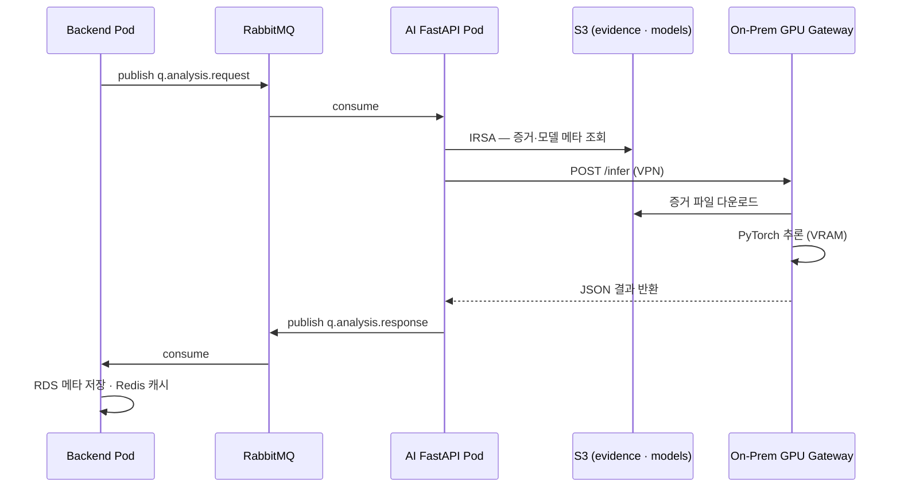
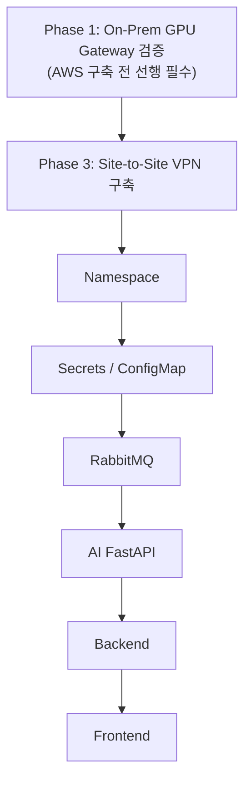
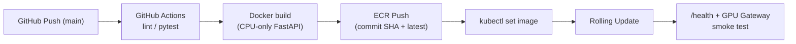

# ForenShield AI — AI 분석 서버 배포 가이드 (Sprint 4)

> **문서 시리즈:** [README](./README.md) · **이전:** [1. GPU](./1.gpu_use_guide.md) · **다음:** [6. Backend](./6.backend-deploy.md)  
> **대상:** EKS AI FastAPI Pod + On-Prem GPU Gateway  
> **관련 문서:** [GPU 자원 활용 가이드](./1.gpu_use_guide.md), [데이터 레이어 배포 가이드](./4.data-layer-deploy.md)  
> **스택:** FastAPI · RabbitMQ · S3 · Site-to-Site VPN · PyTorch (On-Prem)

ForenShield AI의 분석 파이프라인은 **클라우드 오케스트레이션(EKS)** 과 **온프레미스 GPU 추론**으로 분리됩니다. EKS 노드(t3.medium)에는 GPU가 없으며, 무거운 연산은 VPN 경유 On-Prem RTX 5080에서 수행합니다.

---

## 목차

1. [아키텍처 개요](#1-아키텍처-개요)
2. [사전 준비](#2-사전-준비)
3. [On-Prem GPU Gateway 배포](#3-on-prem-gpu-gateway-배포)
4. [환경변수 · Secret 관리](#4-환경변수--secret-관리)
5. [Docker 이미지 빌드 (AI FastAPI)](#5-docker-이미지-빌드-ai-fastapi)
6. [ECR Push](#6-ecr-push)
7. [Kubernetes 리소스 배포](#7-kubernetes-리소스-배포)
8. [배포 검증](#8-배포-검증)
9. [CI/CD 파이프라인](#9-cicd-파이프라인)
10. [롤백 · 재배포](#10-롤백--재배포)
11. [트러블슈팅](#11-트러블슈팅)
12. [진행 체크리스트](#12-진행-체크리스트)

---

## 1. 아키텍처 개요

### 1.1 이중 계층 구조

| 계층 | 위치 | 구성 | 역할 |
|------|------|------|------|
| **AI FastAPI Pod** | EKS `ai-fastapi-ng` | Python / FastAPI | RabbitMQ 메시지 소비, S3 증거·모델 접근, GPU Gateway 호출, 결과 반환 |
| **GPU Gateway** | On-Prem RTX 5080 | Python / FastAPI / PyTorch | 실제 AI 추론·VRAM 연산, S3 증거 다운로드 |

### 1.2 구성 요소

| 계층 | 구성 요소 | 역할 |
|------|-----------|------|
| 노드 | `ai-fastapi-ng` (t3.medium × 1) | AI FastAPI 전용 Worker Node |
| Pod | AI FastAPI | 큐 소비·추론 오케스트레이션 |
| 이미지 | ECR `forenshield-ai-fastapi` | FastAPI 컨테이너 |
| Service | `ai-fastapi` (ClusterIP, port 8000) | 클러스터 내부 헬스·디버그 |
| 메시지 큐 | RabbitMQ | Backend → AI FastAPI 비동기 작업 전달 |
| 스토리지 | S3 `forenshield-evidence` | 증거 원본 (WORM) |
| 스토리지 | S3 `forenshield-models` | AI 모델 파일 (`v1.0/`, `v1.1/`) |
| 네트워크 | Site-to-Site VPN | EKS ↔ On-Prem GPU 암호화 터널 |
| GPU | On-Prem AI Gateway (`:8000`) | `/health`, `/infer` 엔드포인트 |

> RabbitMQ · S3 상세 구성은 [데이터 레이어 배포 가이드](./4.data-layer-deploy.md)를 참고하세요.

### 1.3 분석 요청 흐름



### 1.4 배포 순서 (전체 파이프라인 내 위치)



AI FastAPI는 **RabbitMQ 배포 직후**, **Backend 배포 전**에 진행합니다.

---

## 2. 사전 준비

### 2.1 필수 도구

| 도구 | 용도 | 확인 |
|------|------|------|
| AWS CLI v2 | ECR·S3·VPN 조회 | `aws --version` |
| kubectl | K8s 배포·상태 확인 | `kubectl version --client` |
| docker | AI FastAPI 이미지 빌드 | `docker --version` |
| Python ≥ 3.10 | 로컬 테스트 | `python3 --version` |
| SSH | On-Prem GPU 서버 접속 | `ssh user@<ONPREM_IP>` |

### 2.2 Phase 1 GPU 테스트 완료 (필수)

AWS 인프라 구축 전에 On-Prem GPU Gateway가 아래 기준을 통과해야 합니다.

| # | 항목 | 기대 결과 |
|---|------|-----------|
| 1 | `nvidia-smi` | RTX 5080 정상 인식 |
| 2 | AI Gateway `/health` | `{"status":"ok"}` |
| 3 | 외부 → GPU `/infer` | JSON 응답 수신 |
| 4 | GPU → S3 | 증거·모델 버킷 접근 성공 |

Phase 1 미통과 시 EKS AI FastAPI 배포를 진행해도 GPU 추론 단계에서 실패합니다. 상세: [GPU 자원 활용 가이드 §9](./1.gpu_use_guide.md#9-phase-1--gpu-서버-원격-통제-테스트)

### 2.3 AWS 인프라 선행 조건

| # | 리소스 | 비고 |
|---|--------|------|
| 1 | EKS Cluster `forenshield` | `kubectl` 연결 가능 |
| 2 | Node Group `ai-fastapi-ng` | t3.medium × 1 |
| 3 | ECR `forenshield-ai-fastapi` | Private Repository |
| 4 | Site-to-Site VPN | 터널 상태 UP |
| 5 | S3 `forenshield-evidence` | Object Lock, VPC Endpoint |
| 6 | S3 `forenshield-models` | 버전 관리 (`v1.0/`) |
| 7 | IAM Role (IRSA) | AI Pod → S3 접근 |
| 8 | RabbitMQ Pod | AI FastAPI 배포 전 필수 |

```bash
aws eks update-kubeconfig --name forenshield --region ap-northeast-2
kubectl get nodes -L nodegroup | grep ai-fastapi-ng
aws ecr describe-repositories --repository-names forenshield-ai-fastapi

# VPN · GPU Gateway (EKS debug Pod에서)
ping <ONPREM_GATEWAY_IP>
curl http://<ONPREM_GATEWAY_IP>:8000/health

# RabbitMQ
kubectl get pods -n forenshield -l app=rabbitmq
```

### 2.4 디렉터리 구조 (권장)

```text
Infra/
├── 7.ai-deploy.md
├── 6.backend-deploy.md
├── 5.frontend-deploy.md
└── k8s/
    └── ai-fastapi/
        ├── serviceaccount.yaml
        ├── configmap.yaml
        ├── deployment.yaml
        ├── service.yaml
        └── networkpolicy.yaml

ai-fastapi/                    # 별도 레포 (EKS Pod용)
├── Dockerfile
├── requirements.txt
└── app/
    ├── main.py
    ├── consumer.py            # RabbitMQ consumer
    └── gpu_client.py          # On-Prem GPU 호출

ai-gateway/                    # On-Prem GPU 서버용
├── main.py
├── infer.py
└── requirements.txt
```

---

## 3. On-Prem GPU Gateway 배포

EKS AI FastAPI가 호출하는 추론 엔진입니다. GPU 서버(Ubuntu 22.04)에 직접 배포합니다.

### 3.1 서버 사양 · 네트워크

| 항목 | 값 |
|------|-----|
| GPU | NVIDIA RTX 5080 |
| OS | Ubuntu 22.04 |
| AI Gateway Port | 8000 |
| 내부 IP | `ONPREM_GATEWAY_IP` (예: `192.168.0.10`) |
| VPN CIDR | `ONPREM_PRIVATE_CIDR` (예: `192.168.0.0/24`) |

### 3.2 초기 설정

```bash
# GPU 서버
sudo apt update && sudo apt install -y build-essential git curl python3-venv
nvidia-smi   # 드라이버·CUDA 확인
python3 -m venv ~/venv/forenshield
source ~/venv/forenshield/bin/activate
pip install fastapi uvicorn torch boto3 httpx pydantic
```

### 3.3 AI Gateway 기동

```bash
cd /opt/forenshield/ai-gateway
source ~/venv/forenshield/bin/activate

# 환경변수
export AWS_REGION=ap-northeast-2
export S3_EVIDENCE_BUCKET=forenshield-evidence
export S3_MODELS_BUCKET=forenshield-models
export MODEL_VERSION=v1.0

uvicorn main:app --host 0.0.0.0 --port 8000
```

### 3.4 systemd 등록 (운영)

`/etc/systemd/system/forenshield-ai-gateway.service`

```ini
[Unit]
Description=ForenShield AI Gateway (On-Prem GPU)
After=network.target

[Service]
Type=simple
User=forenshield
WorkingDirectory=/opt/forenshield/ai-gateway
Environment=AWS_REGION=ap-northeast-2
Environment=S3_EVIDENCE_BUCKET=forenshield-evidence
Environment=S3_MODELS_BUCKET=forenshield-models
Environment=MODEL_VERSION=v1.0
ExecStart=/home/forenshield/venv/forenshield/bin/uvicorn main:app \
  --host 0.0.0.0 --port 8000
Restart=always
RestartSec=5

[Install]
WantedBy=multi-user.target
```

```bash
sudo systemctl daemon-reload
sudo systemctl enable forenshield-ai-gateway
sudo systemctl start forenshield-ai-gateway
sudo systemctl status forenshield-ai-gateway
```

### 3.5 GPU Gateway API 스펙

| Method | Path | 설명 | Request Body |
|--------|------|------|--------------|
| GET | `/health` | 헬스체크 | — |
| POST | `/infer` | AI 추론 | `{"case_id":"...", "evidence_path":"s3://forenshield-evidence/..."}` |

```bash
# 로컬 검증
curl http://localhost:8000/health
curl -X POST http://localhost:8000/infer \
  -H "Content-Type: application/json" \
  -d '{"case_id":"test-001","evidence_path":"s3://forenshield-evidence/test/sample.e01"}'
```

### 3.6 S3 접근 (GPU 서버)

| 단계 | 방식 | 비고 |
|------|------|------|
| Phase 1 테스트 | IAM User Access Key (임시) | 테스트 후 반드시 삭제 |
| VPN 구축 후 | IAM Role 또는 Instance Profile | VPC Endpoint 경유 |

```bash
aws s3 ls s3://forenshield-evidence/
aws s3 cp s3://forenshield-models/v1.0/model.pt /opt/forenshield/models/
```

### 3.7 방화벽 · 보안

| 방향 | 포트 | 허용 대상 |
|------|------|-----------|
| Inbound | 8000 | AWS VPN CIDR (`10.0.0.0/16`) |
| Outbound | 443 | S3 VPC Endpoint / AWS API |
| Inbound | 22 | 관리자 IP만 (SSH) |

---

## 4. 환경변수 · Secret 관리

### 4.1 AI FastAPI Pod (EKS) 변수 분류

| 카테고리 | 변수 | 저장 위치 | 값 / 설명 | 민감 |
|----------|------|-----------|-----------|------|
| GPU 연동 | `AI_GATEWAY_URL` | ConfigMap | `http://192.168.0.10:8000` | N |
| GPU 연동 | `AI_GATEWAY_TIMEOUT_SEC` | ConfigMap | `30` (권장) | N |
| GPU 연동 | `AI_GATEWAY_RETRY_COUNT` | ConfigMap | `3` | N |
| RabbitMQ | `RABBITMQ_HOST` | ConfigMap | K8s Service DNS | N |
| RabbitMQ | `RABBITMQ_USER` | Secret | 큐 인증 | Y |
| RabbitMQ | `RABBITMQ_PASSWORD` | Secret | 큐 인증 | Y |
| RabbitMQ | `RABBITMQ_QUEUE_REQUEST` | ConfigMap | `q.analysis.request` | N |
| RabbitMQ | `RABBITMQ_QUEUE_RESPONSE` | ConfigMap | `q.analysis.response` | N |
| S3 | `S3_EVIDENCE_BUCKET` | ConfigMap | `forenshield-evidence` | N |
| S3 | `S3_MODELS_BUCKET` | ConfigMap | `forenshield-models` | N |
| S3 | `MODEL_VERSION` | ConfigMap | `v1.0` | N |
| AWS | `AWS_REGION` | ConfigMap | `ap-northeast-2` | N |

### 4.2 Secret 생성

터미널 히스토리에 비밀번호가 남지 않도록 `--from-env-file` 방식을 사용합니다.

```bash
# secrets/rabbitmq.env (Git 커밋 금지)
RABBITMQ_USER=forenshield
RABBITMQ_PASSWORD=<PASSWORD>

# RabbitMQ (backend와 동일 Secret 재사용 가능 — 이미 생성된 경우 생략)
kubectl create secret generic rabbitmq-credentials -n forenshield \
  --from-env-file=secrets/rabbitmq.env

# S3 (backend와 동일 Secret 재사용 가능 — 이미 생성된 경우 생략)
kubectl create secret generic s3-config -n forenshield \
  --from-env-file=secrets/s3.env
```

Backend 배포 가이드에서 이미 Secret을 생성했다면 이 단계는 건너뜁니다.

### 4.3 ConfigMap

`k8s/ai-fastapi/configmap.yaml`

```yaml
apiVersion: v1
kind: ConfigMap
metadata:
  name: ai-fastapi-config
  namespace: forenshield
data:
  AI_GATEWAY_URL: "http://192.168.0.10:8000"      # 실제 On-Prem IP로 교체
  AI_GATEWAY_TIMEOUT_SEC: "30"
  AI_GATEWAY_RETRY_COUNT: "3"
  RABBITMQ_HOST: "rabbitmq.forenshield.svc.cluster.local"
  RABBITMQ_QUEUE_REQUEST: "q.analysis.request"
  RABBITMQ_QUEUE_RESPONSE: "q.analysis.response"
  S3_EVIDENCE_BUCKET: "forenshield-evidence"
  S3_MODELS_BUCKET: "forenshield-models"
  MODEL_VERSION: "v1.0"
  AWS_REGION: "ap-northeast-2"
  LOG_LEVEL: "INFO"
```

### 4.4 IRSA (S3 접근)

AI FastAPI Pod ServiceAccount에 S3 evidence · models 버킷 Read 권한을 부여합니다.

IAM Policy (최소 권한)

```json
{
  "Version": "2012-10-17",
  "Statement": [
    {
      "Effect": "Allow",
      "Action": ["s3:GetObject", "s3:ListBucket"],
      "Resource": [
        "arn:aws:s3:::forenshield-evidence",
        "arn:aws:s3:::forenshield-evidence/*",
        "arn:aws:s3:::forenshield-models",
        "arn:aws:s3:::forenshield-models/*"
      ]
    }
  ]
}
```

---

## 5. Docker 이미지 빌드 (AI FastAPI)

### 5.1 Dockerfile

EKS Pod는 GPU 없이 CPU 기반 FastAPI만 실행합니다. PyTorch CUDA는 On-Prem GPU Gateway에만 설치합니다.

```dockerfile
# ---- Stage 1: 의존성 설치 ----
FROM python:3.11-slim AS builder
WORKDIR /app
COPY requirements.txt .
RUN pip install --no-cache-dir -r requirements.txt

# ---- Stage 2: 실행 ----
FROM python:3.11-slim AS runner
WORKDIR /app
RUN addgroup --system app && adduser --system --group app
USER app
COPY --from=builder /usr/local/lib/python3.11/site-packages \
  /usr/local/lib/python3.11/site-packages
COPY --from=builder /usr/local/bin /usr/local/bin
COPY app/ ./app/
EXPOSE 8000
CMD ["uvicorn", "app.main:app", "--host", "0.0.0.0", "--port", "8000"]
```

### 5.2 requirements.txt (EKS Pod — CPU only)

```text
fastapi>=0.110.0
uvicorn[standard]>=0.27.0
pika>=1.3.0
httpx>=0.27.0
boto3>=1.34.0
pydantic>=2.0.0
pydantic-settings>=2.0.0
```

`torch`는 EKS Pod에 포함하지 않습니다. 추론은 On-Prem GPU Gateway에서 수행합니다.

### 5.3 애플리케이션 구조

```text
app/main.py       — FastAPI 앱 정의, /health 엔드포인트, RabbitMQ consumer 기동
app/consumer.py   — q.analysis.request 큐 consume → gpu_client 호출
                    → q.analysis.response 큐 publish
app/gpu_client.py — httpx로 AI_GATEWAY_URL/infer POST (timeout · retry)
```

### 5.4 로컬 빌드 · 실행 테스트

```bash
cd <ai-fastapi-repo>

# 빌드
docker build -t forenshield-ai-fastapi:local .

# 로컬 실행
docker run -p 8000:8000 \
  -e AI_GATEWAY_URL=http://host.docker.internal:8000 \
  -e RABBITMQ_HOST=host.docker.internal \
  -e RABBITMQ_USER=forenshield \
  -e RABBITMQ_PASSWORD=<PASSWORD> \
  -e S3_EVIDENCE_BUCKET=forenshield-evidence \
  -e S3_MODELS_BUCKET=forenshield-models \
  -e AWS_REGION=ap-northeast-2 \
  forenshield-ai-fastapi:local

# 헬스체크
curl http://localhost:8000/health
```

---

## 6. ECR Push

### 6.1 변수 설정

```bash
export AWS_REGION=ap-northeast-2
export AWS_ACCOUNT_ID=<12자리 계정 ID>
export IMAGE_TAG=$(git rev-parse --short HEAD)   # commit SHA 사용
export ECR_REPO=$AWS_ACCOUNT_ID.dkr.ecr.$AWS_REGION.amazonaws.com/forenshield-ai-fastapi
```

### 6.2 로그인 · 빌드 · Push

```bash
# ECR 로그인
aws ecr get-login-password --region $AWS_REGION \
  | docker login --username AWS --password-stdin \
    $AWS_ACCOUNT_ID.dkr.ecr.$AWS_REGION.amazonaws.com

# 빌드
docker build -t forenshield-ai-fastapi:$IMAGE_TAG .

# 태그 · Push
docker tag forenshield-ai-fastapi:$IMAGE_TAG $ECR_REPO:$IMAGE_TAG
docker tag forenshield-ai-fastapi:$IMAGE_TAG $ECR_REPO:latest
docker push $ECR_REPO:$IMAGE_TAG
docker push $ECR_REPO:latest
```

### 6.3 Push 확인

```bash
aws ecr describe-images \
  --repository-name forenshield-ai-fastapi \
  --image-ids imageTag=$IMAGE_TAG
```

---

## 7. Kubernetes 리소스 배포

### 7.1 ServiceAccount (IRSA)

`k8s/ai-fastapi/serviceaccount.yaml`

```yaml
apiVersion: v1
kind: ServiceAccount
metadata:
  name: ai-fastapi-sa
  namespace: forenshield
  annotations:
    eks.amazonaws.com/role-arn: arn:aws:iam::<AWS_ACCOUNT_ID>:role/forenshield-ai-fastapi-s3-role
```

### 7.2 Deployment

`k8s/ai-fastapi/deployment.yaml`

```yaml
apiVersion: apps/v1
kind: Deployment
metadata:
  name: ai-fastapi
  namespace: forenshield
  labels:
    app: ai-fastapi
spec:
  replicas: 1
  selector:
    matchLabels:
      app: ai-fastapi
  strategy:
    type: RollingUpdate
    rollingUpdate:
      maxSurge: 1
      maxUnavailable: 0
  template:
    metadata:
      labels:
        app: ai-fastapi
    spec:
      serviceAccountName: ai-fastapi-sa
      nodeSelector:
        nodegroup: ai-fastapi-ng
      containers:
        - name: ai-fastapi
          image: <ECR_REGISTRY>/forenshield-ai-fastapi:<IMAGE_TAG>
          # CI/CD에서 kubectl set image로 교체. 직접 수정 금지
          imagePullPolicy: Always
          ports:
            - name: http
              containerPort: 8000
              protocol: TCP
          envFrom:
            - configMapRef:
                name: ai-fastapi-config
            - secretRef:
                name: rabbitmq-credentials
            - secretRef:
                name: s3-config
          readinessProbe:
            httpGet:
              path: /health
              port: 8000
            initialDelaySeconds: 15
            periodSeconds: 10
            failureThreshold: 3
          livenessProbe:
            httpGet:
              path: /health
              port: 8000
            initialDelaySeconds: 30
            periodSeconds: 15
            failureThreshold: 3
          resources:
            requests:
              cpu: 200m
              memory: 512Mi
            limits:
              cpu: 1000m
              memory: 1Gi
```

### 7.3 Service

`k8s/ai-fastapi/service.yaml`

```yaml
apiVersion: v1
kind: Service
metadata:
  name: ai-fastapi
  namespace: forenshield
  labels:
    app: ai-fastapi
spec:
  type: ClusterIP
  selector:
    app: ai-fastapi
  ports:
    - name: http
      port: 8000
      targetPort: 8000
      protocol: TCP
```

AI FastAPI는 외부 Ingress에 노출하지 않습니다. Backend → RabbitMQ → AI FastAPI 경로로만 통신합니다.

### 7.4 NetworkPolicy

`k8s/ai-fastapi/networkpolicy.yaml`

```yaml
apiVersion: networking.k8s.io/v1
kind: NetworkPolicy
metadata:
  name: ai-fastapi-netpol
  namespace: forenshield
spec:
  podSelector:
    matchLabels:
      app: ai-fastapi
  policyTypes:
    - Ingress
    - Egress
  ingress:
    - from:
        - namespaceSelector:
            matchLabels:
              kubernetes.io/metadata.name: kube-system   # 헬스체크용
      ports:
        - protocol: TCP
          port: 8000
  egress:
    - to:
        - podSelector:
            matchLabels:
              app: rabbitmq
      ports:
        - protocol: TCP
          port: 5672
    - to:
        - ipBlock:
            cidr: 192.168.0.0/24    # On-Prem GPU CIDR (실제 값으로 교체)
      ports:
        - protocol: TCP
          port: 8000
    - to:
        - ipBlock:
            cidr: 10.0.0.0/16       # S3 VPC Endpoint
      ports:
        - protocol: TCP
          port: 443
    - ports:                        # DNS
        - protocol: UDP
          port: 53
```

### 7.5 RabbitMQ Queue 선행 생성

Backend · AI FastAPI가 사용할 Queue를 RabbitMQ 배포 시 함께 정의합니다. ([데이터 레이어 배포 가이드](./4.data-layer-deploy.md) RabbitMQ 섹션 참고)

| 리소스 | 이름 | 용도 |
|--------|------|------|
| Exchange | `exchange.analysis` (Direct) | 라우팅 |
| Queue | `q.analysis.request` | Backend → AI 분석 요청 |
| Queue | `q.analysis.response` | AI → Backend 결과 반환 |

```bash
# RabbitMQ Pod 내부에서
rabbitmqadmin declare exchange name=exchange.analysis type=direct durable=true
rabbitmqadmin declare queue name=q.analysis.request durable=true
rabbitmqadmin declare queue name=q.analysis.response durable=true
rabbitmqadmin declare binding \
  source=exchange.analysis \
  destination=q.analysis.request \
  routing_key=analysis.request
rabbitmqadmin declare binding \
  source=exchange.analysis \
  destination=q.analysis.response \
  routing_key=analysis.response
```

### 7.6 일괄 배포

```bash
kubectl apply -f k8s/ai-fastapi/ -n forenshield
kubectl get pods -n forenshield -l app=ai-fastapi -w
kubectl logs -n forenshield -l app=ai-fastapi --tail=100 -f
```

---

## 8. 배포 검증

### 8.1 계층별 검증 순서

```text
[1] On-Prem GPU Gateway /health
[2] VPN: EKS debug Pod → GPU Gateway /health
[3] AI FastAPI Pod /health
[4] AI FastAPI → GPU Gateway /infer
[5] RabbitMQ 큐 메시지 consume → infer → result publish
[6] Backend → RabbitMQ → AI E2E
```

### 8.2 Pod · Service 검증

```bash
kubectl get pods -n forenshield -l app=ai-fastapi
kubectl get svc ai-fastapi -n forenshield
kubectl run curl-test --rm -it --image=curlimages/curl --restart=Never -n forenshield -- \
  curl -s http://ai-fastapi:8000/health
```

| # | 명령 | 기대 결과 |
|---|------|-----------|
| 1 | Pod 상태 | Running, READY 1/1 |
| 2 | `/health` | `{"status":"ok"}` |
| 3 | Pod → GPU Gateway | `curl http://<ONPREM_GATEWAY_IP>:8000/health` → 200 |

### 8.3 GPU 추론 연동 검증

```bash
# EKS debug Pod에서 GPU Gateway 직접 호출
kubectl run infer-test --rm -it --image=curlimages/curl --restart=Never -n forenshield -- \
  curl -X POST http://<ONPREM_GATEWAY_IP>:8000/infer \
    -H "Content-Type: application/json" \
    -d '{"case_id":"k8s-test-001","evidence_path":"s3://forenshield-evidence/test/sample.e01"}'
```

| # | 확인 항목 | 기대 결과 |
|---|-----------|-----------|
| 1 | VPN 터널 | AWS Console에서 UP |
| 2 | GPU Gateway 응답 | JSON (수 KB ~ 수십 KB) |
| 3 | GPU VRAM | `nvidia-smi` 사용량 증가 후 정상 복귀 |
| 4 | S3 증거 접근 | GPU 서버에서 객체 다운로드 성공 |
| 5 | 타임아웃·재시도 | 30s timeout, 3회 retry 동작 |

### 8.4 RabbitMQ 큐 연동 검증

```bash
kubectl logs -n forenshield -l app=ai-fastapi --tail=50 -f
```

| # | 시나리오 | 기대 결과 |
|---|----------|-----------|
| 1 | `q.analysis.request` publish | AI FastAPI consume 로그 확인 |
| 2 | GPU `/infer` 호출 | HTTP 200, 추론 JSON 반환 |
| 3 | `q.analysis.response` publish | Backend consume 가능 |
| 4 | 실패 시 | retry 정책 동작 확인 |

### 8.5 E2E (Backend 배포 후)

| # | 시나리오 | 기대 결과 |
|---|----------|-----------|
| 1 | 사용자 분석 요청 | Backend → RabbitMQ → AI FastAPI |
| 2 | GPU 추론 | On-Prem GPU JSON 응답 |
| 3 | 결과 저장 | RDS 메타 + Redis 캐시 (Backend) |

---

## 9. CI/CD 파이프라인

### 9.1 파이프라인 흐름



### 9.2 GitHub Actions Secrets

| Secret | 설명 | 민감 |
|--------|------|------|
| `AWS_ROLE_ARN` | OIDC AssumeRole 대상 ARN | Y |
| `AWS_REGION` | `ap-northeast-2` | N |
| `ECR_REGISTRY` | `<account>.dkr.ecr.ap-northeast-2.amazonaws.com` | Y |
| `EKS_CLUSTER_NAME` | `forenshield` | N |

GPU Gateway는 On-Prem 서버에서 별도 배포합니다. CI/CD 대상은 **EKS AI FastAPI Pod**만 해당합니다.

### 9.3 GitHub Actions 워크플로

`.github/workflows/ai-fastapi-deploy.yml`

```yaml
name: AI FastAPI Deploy

on:
  push:
    branches: [main]
    paths:
      - "ai-fastapi/**"
      - ".github/workflows/ai-fastapi-deploy.yml"

permissions:
  id-token: write
  contents: read

env:
  AWS_REGION: ap-northeast-2
  ECR_REPOSITORY: forenshield-ai-fastapi
  EKS_CLUSTER: forenshield
  K8S_NAMESPACE: forenshield

jobs:
  deploy:
    runs-on: ubuntu-latest
    steps:
      - uses: actions/checkout@v4

      - name: Set up Python
        uses: actions/setup-python@v5
        with:
          python-version: "3.11"

      - name: Run tests
        run: |
          pip install -r requirements.txt pytest
          pytest
        working-directory: ai-fastapi

      - name: Configure AWS credentials
        uses: aws-actions/configure-aws-credentials@v4
        with:
          role-to-assume: ${{ secrets.AWS_ROLE_ARN }}
          aws-region: ${{ env.AWS_REGION }}

      - name: Login to ECR
        id: ecr
        uses: aws-actions/amazon-ecr-login@v2

      - name: Build and push
        env:
          IMAGE_TAG: ${{ github.sha }}
          ECR_REGISTRY: ${{ steps.ecr.outputs.registry }}
        run: |
          docker build \
            -t $ECR_REGISTRY/$ECR_REPOSITORY:$IMAGE_TAG \
            -t $ECR_REGISTRY/$ECR_REPOSITORY:latest \
            ./ai-fastapi
          docker push $ECR_REGISTRY/$ECR_REPOSITORY:$IMAGE_TAG
          docker push $ECR_REGISTRY/$ECR_REPOSITORY:latest

      - name: Update kubeconfig
        run: aws eks update-kubeconfig --name $EKS_CLUSTER --region $AWS_REGION

      - name: Deploy to EKS
        env:
          IMAGE_TAG: ${{ github.sha }}
          ECR_REGISTRY: ${{ steps.ecr.outputs.registry }}
        run: |
          kubectl set image deployment/ai-fastapi \
            ai-fastapi=$ECR_REGISTRY/$ECR_REPOSITORY:$IMAGE_TAG \
            -n $K8S_NAMESPACE
          kubectl rollout status deployment/ai-fastapi \
            -n $K8S_NAMESPACE --timeout=300s

      - name: Health check
        run: |
          kubectl run ai-health-check --rm -i --restart=Never \
            --image=curlimages/curl -n $K8S_NAMESPACE -- \
            curl -sf http://ai-fastapi:8000/health
```

---

## 10. 롤백 · 재배포

### 10.1 AI FastAPI Pod 롤백

```bash
# 배포 이력 확인
kubectl rollout history deployment/ai-fastapi -n forenshield

# 직전 버전으로 롤백
kubectl rollout undo deployment/ai-fastapi -n forenshield

# 롤백 상태 확인
kubectl rollout status deployment/ai-fastapi -n forenshield
```

### 10.2 GPU Gateway 롤백 (On-Prem)

```bash
sudo systemctl stop forenshield-ai-gateway
cd /opt/forenshield/ai-gateway && git checkout <이전_태그>
sudo systemctl start forenshield-ai-gateway
curl http://localhost:8000/health
```

### 10.3 모델 버전 전환

```bash
# ConfigMap MODEL_VERSION 변경 후 Pod 재시작
kubectl patch configmap ai-fastapi-config -n forenshield \
  --type merge -p '{"data":{"MODEL_VERSION":"v1.1"}}'
kubectl rollout restart deployment/ai-fastapi -n forenshield
```

### 10.4 스케일 조정 (비용 절감)

```bash
# 개발 종료 시
kubectl scale deployment/ai-fastapi --replicas=0 -n forenshield

# 재개
kubectl scale deployment/ai-fastapi --replicas=1 -n forenshield
```

---

## 11. 트러블슈팅

| 증상 | 원인 | 해결 |
|------|------|------|
| Pod → GPU Connection timed out | VPN 터널 DOWN · 라우팅 오류 | VPN 상태 · Route Table · On-Prem CIDR 확인 |
| GPU `/infer` 504 | VRAM 부족 · 모델 미로드 | `nvidia-smi`, S3 모델 경로 확인 ([GPU 가이드 §8](./1.gpu_use_guide.md#8-udpb-213--gpu-메모리-초과-대응)) |
| RabbitMQ consume 안 됨 | Queue 미생성 · 바인딩 오류 | `q.analysis.request` Queue · credentials 확인 |
| S3 AccessDenied (AI Pod) | IRSA Role / Policy 오류 | ServiceAccount annotation · IAM Policy 확인 |
| S3 AccessDenied (GPU) | IAM Key 만료 · 버킷 정책 | GPU 서버 credentials, VPC Endpoint 확인 |
| ImagePullBackOff | ECR 태그 · 권한 | 이미지 태그, Node Role ECR ReadOnly 확인 |
| 추론 결과 지연 | 대용량 증거 파일 | S3 transfer · GPU download 병목 프로파일링 |
| Pod OOMKilled | 메모리 limit 부족 | limits 1Gi → 2Gi 조정 |
| GPU Gateway 재시작 반복 | CUDA / driver 오류 | `journalctl -u forenshield-ai-gateway`, `nvidia-smi` |

로그 확인

```bash
# EKS AI FastAPI
kubectl logs -n forenshield -l app=ai-fastapi --tail=200 -f
kubectl describe pod -n forenshield -l app=ai-fastapi
kubectl get events -n forenshield --sort-by='.lastTimestamp'

# On-Prem GPU Gateway
sudo journalctl -u forenshield-ai-gateway -f

# VPN 상태
aws ec2 describe-vpn-connections \
  --query 'VpnConnections[*].VgwTelemetry'
```

---

## 12. 진행 체크리스트

### Phase 1 — On-Prem GPU (선행 필수)

- [ ] GPU 서버 SSH 접속
- [ ] `nvidia-smi` / CUDA / PyTorch 정상
- [ ] AI Gateway `/health` OK
- [ ] `/infer` API 원격 호출 성공
- [ ] S3 `forenshield-evidence` · `forenshield-models` 접근 성공
- [ ] 테스트용 Access Key 삭제 완료

### AWS 인프라

- [ ] Site-to-Site VPN 터널 UP
- [ ] EKS `ai-fastapi-ng` Node Group 가동
- [ ] ECR `forenshield-ai-fastapi` 레포 생성
- [ ] S3 evidence · models 버킷 + VPC Endpoint
- [ ] IRSA Role · ServiceAccount 설정
- [ ] RabbitMQ Pod · Queue (`q.analysis.request`, `q.analysis.response`) 생성

### On-Prem GPU Gateway

- [ ] systemd 서비스 등록 · 자동 기동
- [ ] 방화벽 8000 (VPN CIDR만 허용)
- [ ] VPN 경유 EKS → GPU `/health` 확인

### AI FastAPI Pod (EKS)

- [ ] `secrets/rabbitmq.env` · `s3.env` 작성 (`.gitignore` 확인)
- [ ] ConfigMap · Secret 생성
- [ ] Deployment · Service · NetworkPolicy 적용
- [ ] Pod Running / READY 1/1
- [ ] `/health` → `{"status":"ok"}`
- [ ] Pod → GPU Gateway `/infer` 성공
- [ ] `q.analysis.request` consume · `q.analysis.response` publish 확인

### E2E · CI/CD

- [ ] Backend → RabbitMQ → AI → GPU E2E 통과
- [ ] GitHub Actions 자동 배포 확인
- [ ] GPU Gateway · AI FastAPI 롤백 절차 1회 테스트
