# ForenShield AI — E2E 통합 테스트 가이드 (Sprint 4)

> **문서 시리즈:** [README](./README.md) · **전제:** [5~7번](./README.md#문서-목록) 배포 완료  
> **대상:** Production 배포 환경 (실주소)  
> **관련 문서:** [Terraform architecture](./2.Terraform%20architecture.md), [GPU 자원 활용 가이드](./1.gpu_use_guide.md)  
> **스프린트:** Sprint 4 — 최종 점검

로컬 개발 프로세스를 벗어나 **실제 배포 주소(Production URL)** 를 타깃으로 프론트엔드부터 AI 엔진, 인프라 저장소까지 이어지는 포렌식 분석의 전체 서비스 생명 주기(End-to-End) 가용성을 완벽히 검증합니다.

---

## 목차

1. [개요](#1-개요)
2. [사전 준비](#2-사전-준비)
3. [테스트 시나리오](#3-테스트-시나리오)
4. [실패 · 병목 시나리오 검증](#4-실패--병목-시나리오-검증)
5. [전체 파이프라인 최종 체크리스트](#5-전체-파이프라인-최종-체크리스트)
6. [테스트 결과 기록](#6-테스트-결과-기록)

---

## 1. 개요

### 1.1 목적

로컬 개발 환경을 벗어나 실제 배포 주소(Production URL)를 타깃으로 프론트엔드부터 AI 엔진, 인프라 저장소까지 이어지는 포렌식 분석의 전체 서비스 생명 주기(End-to-End) 가용성을 검증한다.

### 1.2 테스트 범위

| 영역 | 검증 내용 |
|------|-----------|
| **사용자 인증** | 로그인 / 회원가입 트랜잭션 |
| **증거 파일 업로드** | 영상 / 음성 / 이미지 무결성 업로드 스트리밍 |
| **무결성 · 저장** | SHA-256 해시 생성 · S3 저장 · CoC 감사로그 적재 |
| **비동기 분석** | RabbitMQ 큐 발행 · AI FastAPI 소비 |
| **GPU 추론** | On-Prem GPU Gateway 추론 완료 |
| **상태 전이** | UI 폴링 — 대기중 → 분석중 → 완료 |
| **결과 시각화** | 상세페이지 컴포넌트 바인딩 |
| **PDF 리포트** | 법원 제출용 포렌식 리포트 다운로드 |
| **예외 처리** | 프로덕션 실패 · 병목 시나리오 검출 |

### 1.3 E2E 파이프라인 흐름

```mermaid
flowchart LR
    A[로그인 / 회원가입] --> B[사건 생성]
    B --> C[증거 파일 업로드]
    C --> D[SHA-256 · S3 · CoC UPLOAD]
    D --> E[분석 요청 · RabbitMQ 발행]
    E --> F[AI FastAPI consume]
    F --> G[On-Prem GPU 추론]
    G --> H[결과 저장 · RDS · Redis]
    H --> I[상태 전이 PENDING→PROCESSING→COMPLETED]
    I --> J[결과 상세 페이지]
    J --> K[PDF 리포트 다운로드]
```



**텍스트 흐름:**

```
사용자 인증 (로그인/회원가입)
    → 증거 파일 업로드 (영상/음성/이미지)
        → SHA-256 해시 생성 · S3 저장 · CoC 로그 적재
            → RabbitMQ 비동기 큐 발행 · AI FastAPI 소비
                → On-Prem GPU 추론
                    → 분석 결과 상태 전이 (대기중 → 분석중 → 완료)
                        → 결과 상세 페이지 시각화
                            → PDF 포렌식 리포트 다운로드
```

### 1.4 구현 방식 (Happy Path)

QA 시나리오북에 기반하여 **해피 패스(Happy Path)** 를 순차 실행한다.

1. 수사관 계정으로 로그인
2. 딥페이크 변조 의혹이 있는 `.mp4` 파일을 업로드 영역에 입력
3. 백엔드가 SHA-256 해시를 추출하고 CoC 감사로그 테이블에 적재하는지 확인
4. RabbitMQ 메시지를 통해 FastAPI 워커로 제어권이 전달되는지 확인
5. 화면에서 3초 주기 폴링으로 `대기중 → 분석중 → 완료` 배지 전이 관측
6. 최종 상세페이지 조회 후 위변조 분석 근거가 서명된 PDF 산출물이 정상 다운로드되는지 검증

### 1.5 완료 기준

배포 환경 실주소에서 위 전체 파이프라인이 **단 한 번의 500 에러나 런타임 크래시 없이** 완결되어야 합니다.

| 기준 | 내용 |
|------|------|
| **파이프라인** | 로그인 → 파일 업로드 → 비동기 큐 분석 → 상세 결과 확인 → PDF 추출 |
| **에러** | 500 에러 · 런타임 크래시 없음 |
| **환경** | 배포망 실주소 (Production URL) |

### 1.6 테스트 환경

| 항목 | 값 |
|------|-----|
| **타깃 URL** | `https://<your-domain>` |
| **브라우저** | Chrome 최신 버전 |
| **도구** | Chrome DevTools / Network Tab |
| **테스트 계정** | 수사관 계정 (사전 등록) |
| **테스트 파일** | 딥페이크 의심 `.mp4` / `.wav` / `.jpg` (사전 준비) |

---

## 2. 사전 준비

### 2.1 인프라 전체 가동 확인

E2E 테스트 시작 전 모든 컴포넌트가 정상 상태인지 확인합니다.

**전체 Pod 상태:**

```bash
kubectl get pods -n forenshield
```

**기대 결과:**

```
NAME                          READY   STATUS    RESTARTS
frontend-xxx                  2/2     Running   0         # Nginx + Next.js
backend-xxx                   1/1     Running   0
ai-fastapi-xxx                1/1     Running   0
rabbitmq-xxx                  1/1     Running   0
```

**서비스별 헬스체크:**

```bash
curl -s https://<your-domain>/health                  # Frontend Nginx → ok
curl -s https://<your-domain>/api/actuator/health     # Backend → {"status":"UP"}
curl -s http://ai-fastapi:8000/health                 # AI FastAPI (내부)

# On-Prem GPU Gateway
ssh user@<ONPREM_IP> "curl -s http://localhost:8000/health"

# VPN 터널
aws ec2 describe-vpn-connections \
  --query 'VpnConnections[*].VgwTelemetry[*].Status'
```

### 2.2 테스트 파일 준비

| 파일명 | 형식 | 크기 | 용도 |
|--------|------|------|------|
| `test_video.mp4` | MP4 (H.264) | 10~50MB | 영상 딥페이크 탐지 |
| `test_audio.wav` | WAV / MP3 | 1~5MB | 음성 합성 탐지 |
| `test_image.jpg` | JPEG | 500KB~2MB | 이미지 위변조 탐지 |

### 2.3 Chrome DevTools 설정

1. `F12` → **Network** 탭 열기
2. **Preserve log** 체크 (페이지 이동 시 로그 유지)
3. **Disable cache** 체크 (캐시 배제)
4. Filter: **XHR / Fetch** 선택

### 2.4 백엔드 로그 실시간 모니터링 (별도 터미널)

```bash
# 터미널 1 — Backend 로그
kubectl logs -n forenshield -l app=backend --tail=0 -f

# 터미널 2 — AI FastAPI 로그
kubectl logs -n forenshield -l app=ai-fastapi --tail=0 -f

# 터미널 3 — GPU Gateway 로그 (On-Prem)
ssh user@<ONPREM_IP> "sudo journalctl -u forenshield-ai-gateway -f"
```

---

## 3. 테스트 시나리오

### 시나리오 1 — 사용자 인증

**목적:** 배포 환경에서 로그인/회원가입 트랜잭션 정상 동작 확인

| # | 액션 | 검증 항목 | 기대 결과 |
|---|------|-----------|-----------|
| 1 | `https://<your-domain>` 접속 | 메인 페이지 렌더링 | HTML 200, JS/CSS 로드 완료 |
| 2 | 회원가입 | `POST /api/v1/auth/signup` | HTTP 201, 계정 생성 |
| 3 | 로그인 (수사관 계정) | `POST /api/v1/auth/login` | HTTP 200, JWT 토큰 수신 |
| 4 | 토큰 저장 확인 | DevTools → Application → Storage | JWT 정상 저장 |
| 5 | 대시보드 진입 | `GET /api/v1/cases` | HTTP 200, 사건 목록 |

**DevTools 확인 포인트:**

```
Network → /api/v1/auth/login
→ Status: 200
→ Response: { "token": "eyJ..." }
→ Set-Cookie 또는 localStorage 저장 확인
```

**로그 확인:**

```bash
# Backend 로그에서 인증 성공 확인
kubectl logs -n forenshield -l app=backend --tail=20
# 기대: "Authentication successful for user: investigator@..."
```

---

### 시나리오 2 — 사건 생성

**목적:** 증거 파일을 관리할 사건 단위 등록

| # | 액션 | 검증 항목 | 기대 결과 |
|---|------|-----------|-----------|
| 1 | 사건 생성 버튼 클릭 | `POST /api/v1/cases` | HTTP 201, `case_id` 반환 |
| 2 | 사건명·설명 입력 후 저장 | RDS `cases` 테이블 | DB에 사건 레코드 생성 |
| 3 | 생성된 사건 상세 페이지 진입 | `GET /api/v1/cases/{case_id}` | HTTP 200 |

**RDS 확인 (디버그 Pod):**

```bash
kubectl run pg-test --rm -it --image=postgres:16-alpine --restart=Never -n forenshield -- \
  psql -h <RDS_ENDPOINT> -U forenshield -d forenshield \
  -c "SELECT * FROM cases ORDER BY created_at DESC LIMIT 1;"
```

---

### 시나리오 3 — 증거 파일 업로드 · 무결성 검증 (핵심)

**목적:** 파일 업로드 → SHA-256 생성 → S3 저장 → CoC 로그 적재 전체 흐름 확인

| # | 액션 | 검증 항목 | 기대 결과 |
|---|------|-----------|-----------|
| 1 | `test_video.mp4` 업로드 | `POST /api/v1/cases/{case_id}/files` | HTTP 201, `file_id` · `sha256_hash` 반환 |
| 2 | SHA-256 해시 확인 | Response Body | `sha256_hash` 값 존재 |
| 3 | S3 원본 저장 확인 | AWS CLI | `forenshield-evidence/cases/{case_id}/{file_id}/original/` 객체 존재 |
| 4 | CoC 로그 적재 확인 | RDS `coc_logs` | `UPLOAD` 이벤트 · 해시 체인 기록 |
| 5 | `files` 테이블 확인 | RDS `files` | `s3_origin_key` · `sha256_hash` 정상 기록 |

**DevTools 확인 포인트:**

```
Network → POST /api/v1/cases/{case_id}/files
→ Status: 201
→ Response:
  {
    "file_id": "uuid",
    "sha256_hash": "a3f...",
    "s3_origin_key": "cases/{case_id}/{file_id}/original/test_video.mp4"
  }
```

**S3 저장 확인:**

```bash
aws s3 ls s3://forenshield-evidence/cases/<case_id>/ --recursive
# 기대:
# cases/{case_id}/{file_id}/original/test_video.mp4
```

**CoC 로그 확인:**

```bash
kubectl run pg-test --rm -it --image=postgres:16-alpine --restart=Never -n forenshield -- \
  psql -h <RDS_ENDPOINT> -U forenshield -d forenshield \
  -c "SELECT log_id, action_type, current_hash, previous_log_hash, timestamp
      FROM coc_logs
      WHERE action_type = 'UPLOAD'
      ORDER BY timestamp DESC LIMIT 3;"
# 기대:
# action_type: UPLOAD
# current_hash: sha256 값 존재
# previous_log_hash: 이전 로그 해시 연결
```

---

### 시나리오 4 — 비동기 분석 요청 · 큐 발행

**목적:** Backend → RabbitMQ → AI FastAPI 큐 흐름 확인

| # | 액션 | 검증 항목 | 기대 결과 |
|---|------|-----------|-----------|
| 1 | 분석 요청 버튼 클릭 | `POST /api/v1/cases/{case_id}/files/{file_id}/analyze` | HTTP 202, `request_id` 반환 |
| 2 | `analysis_requests` 상태 | RDS | `status = PENDING` |
| 3 | RabbitMQ 큐 메시지 | AI FastAPI 로그 | `q.analysis.request` consume 로그 |
| 4 | CoC 로그 적재 | RDS `coc_logs` | `ANALYZE` 이벤트 기록 |

**DevTools 확인 포인트:**

```
Network → POST /api/v1/cases/{case_id}/files/{file_id}/analyze
→ Status: 202 (즉시 반환, 비동기 처리)
→ Response:
  {
    "request_id": "uuid",
    "status": "PENDING"
  }
```

**RabbitMQ 큐 메시지 확인:**

```bash
# AI FastAPI 로그에서 consume 확인
kubectl logs -n forenshield -l app=ai-fastapi --tail=20
# 기대:
# "Consumed message from q.analysis.request: request_id=uuid"
# "Calling GPU Gateway: POST /infer"
```

**RDS 상태 확인:**

```bash
kubectl run pg-test --rm -it --image=postgres:16-alpine --restart=Never -n forenshield -- \
  psql -h <RDS_ENDPOINT> -U forenshield -d forenshield \
  -c "SELECT request_id, status, created_at FROM analysis_requests
      ORDER BY created_at DESC LIMIT 1;"
# 기대: status = PENDING → PROCESSING
```

---

### 시나리오 5 — 분석 상태 전이 관찰

**목적:** UI 폴링 인터벌(3초)을 통한 상태 배지 전이 확인

| 상태 | 배지 | 조건 |
|------|------|------|
| `PENDING` | 대기중 🟡 | 큐 발행 직후 |
| `PROCESSING` | 분석중 🔵 | AI FastAPI consume 후 |
| `COMPLETED` | 완료 🟢 | GPU 추론 완료 · 결과 저장 |
| `FAILED` | 실패 🔴 | 오류 발생 시 |

**DevTools 확인 포인트:**

```
Network → GET /api/v1/cases/{case_id}/files/{file_id}/status (3초 주기)
→ 1차: { "status": "PENDING" }
→ 2차: { "status": "PROCESSING" }
→ 3차: { "status": "COMPLETED" }
```

**폴링 중 Backend 로그:**

```bash
kubectl logs -n forenshield -l app=backend --tail=30
# 기대:
# "Status updated: request_id=uuid → PROCESSING"
# "Status updated: request_id=uuid → COMPLETED"
```

---

### 시나리오 6 — GPU 추론 · 결과 저장

**목적:** On-Prem GPU 추론 완료 후 결과가 RDS · Redis에 정상 저장되는지 확인

| # | 액션 | 검증 항목 | 기대 결과 |
|---|------|-----------|-----------|
| 1 | GPU 추론 완료 | AI FastAPI 로그 | GPU Gateway HTTP 200 · JSON 응답 수신 |
| 2 | `q.analysis.response` publish | Backend 로그 | Backend consume 로그 |
| 3 | RDS 결과 저장 | `analysis_requests` | `risk_score`, `video_result`, `audio_result`, `image_result` 기록 |
| 4 | Redis 캐시 | ElastiCache | 결과 캐시 저장 |
| 5 | CoC 로그 | `coc_logs` | `ANALYZE` 완료 이벤트 · 해시 체인 연결 |

**GPU 로그 확인 (On-Prem):**

```bash
ssh user@<ONPREM_IP> "sudo journalctl -u forenshield-ai-gateway --tail=20"
# 기대:
# "Inference completed: case_id=uuid, risk_score=72"
```

**RDS 결과 확인:**

```bash
kubectl run pg-test --rm -it --image=postgres:16-alpine --restart=Never -n forenshield -- \
  psql -h <RDS_ENDPOINT> -U forenshield -d forenshield \
  -c "SELECT request_id, status, risk_score, created_at, updated_at
      FROM analysis_requests
      ORDER BY updated_at DESC LIMIT 1;"
# 기대: status = COMPLETED, risk_score = 정수값
```

**Redis 캐시 확인:**

```bash
kubectl run redis-test --rm -it --image=redis:7-alpine --restart=Never -n forenshield -- \
  redis-cli -h <REDIS_ENDPOINT> -a <PASSWORD> \
  keys "analysis:*"
```

---

### 시나리오 7 — 결과 상세 페이지 시각화

**목적:** 분석 결과 UI 컴포넌트 바인딩 확인

| # | 액션 | 검증 항목 | 기대 결과 |
|---|------|-----------|-----------|
| 1 | 상세 페이지 진입 | `GET /api/v1/cases/{case_id}/files/{file_id}/result` | HTTP 200, 분석 결과 JSON |
| 2 | 위험도 점수 표시 | UI `risk_score` 컴포넌트 | 0~100 수치 렌더링 |
| 3 | 모달별 분석 결과 | `video_result` / `audio_result` / `image_result` | 각 모달 결과 카드 표시 |
| 4 | XAI 시각화 | 근거 히트맵 / 차트 | 위변조 근거 시각 자료 렌더링 |
| 5 | CoC 이력 조회 | `GET /api/v1/cases/{case_id}/coc` | 전체 감사 로그 타임라인 |

**DevTools 확인 포인트:**

```
Network → GET /api/v1/cases/{case_id}/files/{file_id}/result
→ Status: 200
→ Response:
  {
    "risk_score": 72,
    "video_result": { "face_swap": 0.85, "lip_sync": 0.71 },
    "audio_result": { "tts_probability": 0.23 },
    "image_result": { "ela_score": 0.15 }
  }
```

---

### 시나리오 8 — PDF 포렌식 리포트 다운로드 (최종)

**목적:** 법원 제출용 포렌식 리포트 생성 · 다운로드 E2E 완결

| # | 액션 | 검증 항목 | 기대 결과 |
|---|------|-----------|-----------|
| 1 | PDF 생성 요청 | `POST /api/v1/cases/{case_id}/files/{file_id}/report` | HTTP 200 또는 202 |
| 2 | S3 리포트 저장 확인 | `forenshield-evidence/.../reports/report.pdf` | 객체 존재 |
| 3 | PDF 다운로드 | `GET /api/v1/cases/{case_id}/files/{file_id}/report/download` | `Content-Type: application/pdf` |
| 4 | PDF 내용 확인 | 파일 열기 | 원본 해시 · 분석 결과 · 감사 로그 포함 |
| 5 | CoC 로그 | RDS `coc_logs` | `PRINT` 이벤트 기록 |

**DevTools 확인 포인트:**

```
Network → GET /api/v1/.../report/download
→ Status: 200
→ Content-Type: application/pdf
→ Content-Disposition: attachment; filename="forenshield_report_{case_id}.pdf"
→ Response: PDF 바이너리 (다운로드 시작)
```

**S3 리포트 저장 확인:**

```bash
aws s3 ls s3://forenshield-evidence/cases/<case_id>/ --recursive
# 기대:
# cases/{case_id}/{file_id}/reports/report.pdf
```

**PDF 내용 검증 항목:**

- [ ] 사건 ID · 파일명 · 업로드 시각
- [ ] SHA-256 원본 해시값
- [ ] 분석 모델 버전 (`MODEL_VERSION`)
- [ ] 모달별 분석 결과 (영상/음성/이미지)
- [ ] 통합 위험도 점수 (0~100)
- [ ] XAI 근거 요약
- [ ] Chain of Custody 감사 로그
- [ ] 리포트 생성 시각 · 분석 담당자

---

## 4. 실패 · 병목 시나리오 검증

### 4.1 예외 처리 검증

| 시나리오 | 입력 | 기대 결과 |
|----------|------|-----------|
| 지원하지 않는 파일 형식 | `.exe` 업로드 | HTTP 400, 명확한 에러 메시지 |
| 파일 크기 초과 | 500MB 이상 | HTTP 413 또는 청크 처리 |
| 인증 만료 후 API 호출 | 만료된 JWT | HTTP 401, 로그인 페이지 리다이렉트 |
| 동일 파일 중복 업로드 | 동일 SHA-256 | HTTP 409 또는 기존 파일 ID 반환 |
| 분석 중 GPU Gateway 다운 | VPN 차단 시뮬레이션 | `status = FAILED`, 에러 로그 기록 |

### 4.2 대용량 파일 병목 테스트

```bash
# 500MB 이상 파일 업로드 테스트
# RabbitMQ 큐 타임아웃 검증
kubectl logs -n forenshield -l app=ai-fastapi --tail=50
# 기대: 타임아웃(30s) 초과 시 retry 3회 후 FAILED 처리
```

### 4.3 CoC 무결성 위변조 방어 테스트

```bash
# coc_logs 직접 수정 시도 → 실패해야 함
kubectl run pg-test --rm -it --image=postgres:16-alpine --restart=Never -n forenshield -- \
  psql -h <RDS_ENDPOINT> -U forenshield -d forenshield \
  -c "UPDATE coc_logs SET action_type = 'TAMPERED' WHERE log_id = 1;"
# 기대: ERROR (Append-Only 정책 · 권한 차단)
```

---

## 5. 전체 파이프라인 최종 체크리스트

### 인프라 상태

- [ ] 전체 Pod Running / READY 정상
- [ ] VPN 터널 UP
- [ ] On-Prem GPU Gateway `/health` OK
- [ ] RabbitMQ `q.analysis.request` · `q.analysis.response` 큐 존재
- [ ] S3 `forenshield-evidence` VPC Endpoint 접근 정상
- [ ] RDS PostgreSQL · ElastiCache Redis 연결 정상
- [ ] CloudWatch 알람 임계값 초과 없음

### 시나리오 1 — 사용자 인증

- [ ] 회원가입 HTTP 201
- [ ] 로그인 HTTP 200 · JWT 토큰 수신
- [ ] 대시보드 진입 HTTP 200

### 시나리오 2 — 사건 생성

- [ ] 사건 생성 HTTP 201 · `case_id` 반환
- [ ] RDS `cases` 테이블 레코드 확인

### 시나리오 3 — 파일 업로드 · 무결성

- [ ] 업로드 HTTP 201 · `sha256_hash` 반환
- [ ] S3 `forenshield-evidence` 원본 객체 확인
- [ ] RDS `files` 테이블 `s3_origin_key` · `sha256_hash` 기록
- [ ] RDS `coc_logs` `UPLOAD` 이벤트 · 해시 체인 기록

### 시나리오 4 — 비동기 분석 요청

- [ ] 분석 요청 HTTP 202 · `request_id` 반환
- [ ] RDS `analysis_requests` `status = PENDING`
- [ ] AI FastAPI 로그에서 `q.analysis.request` consume 확인
- [ ] RDS `coc_logs` `ANALYZE` 이벤트 기록

### 시나리오 5 — 상태 전이

- [ ] UI 폴링 3초 주기 동작
- [ ] `PENDING` → `PROCESSING` → `COMPLETED` 배지 전이
- [ ] DevTools Network 상태 응답 변화 확인

### 시나리오 6 — GPU 추론 · 결과 저장

- [ ] GPU Gateway `/infer` HTTP 200 · JSON 응답
- [ ] `q.analysis.response` Backend consume 확인
- [ ] RDS `analysis_requests` `risk_score` · 모달별 결과 기록
- [ ] Redis 결과 캐시 저장
- [ ] RDS `coc_logs` `ANALYZE` 완료 이벤트 · 해시 체인 연결

### 시나리오 7 — 결과 상세 페이지

- [ ] 결과 API HTTP 200 · JSON 정상
- [ ] 위험도 점수 UI 렌더링
- [ ] 모달별 결과 카드 표시
- [ ] XAI 시각화 컴포넌트 정상 렌더링
- [ ] CoC 이력 타임라인 표시

### 시나리오 8 — PDF 리포트

- [ ] PDF 생성 HTTP 200/202
- [ ] S3 `forenshield-evidence` `reports/` 객체 확인
- [ ] 다운로드 `Content-Type: application/pdf`
- [ ] PDF 내용: 원본 해시 · 분석 결과 · 감사 로그 포함
- [ ] RDS `coc_logs` `PRINT` 이벤트 기록

### 예외 처리

- [ ] 지원하지 않는 파일 형식 HTTP 400
- [ ] 대용량 파일 처리 또는 HTTP 413
- [ ] 만료 토큰 HTTP 401 · 리다이렉트
- [ ] 중복 파일 HTTP 409 또는 기존 ID 반환
- [ ] GPU 장애 시 `status = FAILED` · 에러 로그
- [ ] CoC 직접 수정 시도 → 차단

---

## 6. 테스트 결과 기록

테스트 완료 후 아래 항목을 팀 공유 문서에 기록합니다.

| 항목 | 내용 |
|------|------|
| **테스트 일시** | YYYY-MM-DD HH:MM |
| **테스트 환경** | Production (`https://<your-domain>`) |
| **테스트 담당자** | |
| **전체 시나리오 통과 여부** | Pass / Fail |
| **발견된 버그 · 이슈** | GitHub Issues 링크 |
| **평균 분석 소요 시간** | 초 단위 |
| **PDF 생성 소요 시간** | 초 단위 |
| **500 에러 발생 여부** | 없음 / 있음 (횟수 · 경로) |
| **특이사항** | |
